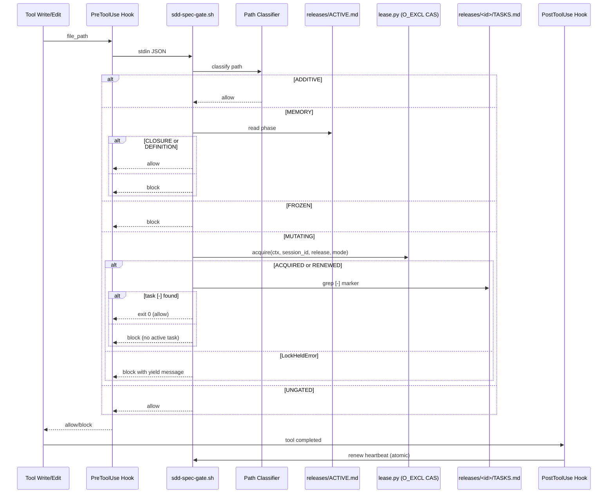

Assets: `.dadaia/scripts/sdd-spec-gate.sh` (PreToolUse) · `.dadaia/scripts/sdd-post-gate.sh` (PostToolUse) · Codex projeta `UserPromptSubmit` onde suportado.

## Propósito

Par de hooks bash que intercepta invocações de ferramentas em Claude Code,
Codex e equivalentes. `sdd-spec-gate.sh` decide **allow** ou **block** antes de
writes; `sdd-post-gate.sh` renova o heartbeat do lease após cada tool call.

O gate usa um **path-classifier de 5 classes**, aplicado sequencialmente:

| Classe | Paths | Decisão |
|--------|-------|---------|
| ADDITIVE | `specs/backlog/**`, `specs/bugs/**`, `specs/audits/**`, `.dadaia/reports/**`, `.dadaia/handoff/**` | Allow incondicional — nenhum lease check |
| MEMORY | `specs/memory/**/*.md` | Allow apenas em fase CLOSURE ou DEFINITION; block caso contrário |
| FROZEN | `specs/_archive/**` | Block sempre |
| MUTATING | Código de produção, `specs/releases/**` | Acquire lease via O_EXCL CAS; block em live-lease conflict; requer task `[-]` |
| UNGATED | `.dadaia/tmp/**`, logs, sentinels | Allow incondicional |

**Regras adicionais:**
- **RULE A (memory atomicity):** `specs/memory/**/*.md` fora de CLOSURE/DEFINITION → block. Formatos legados `.html`, `.yaml`, `.yml` → block sempre.
- **RULE B (archive read-only):** `specs/_archive/**` → block sempre.
- **RULE D (path-scope) — REMOVIDO em 0.1.7 rc-3:** era fail-open e nunca disparava para um agente (persona nunca no env do hook). Path-scope agora é convenção de instrução do agente, não gate.
- **RULE C (task marker):** exige pelo menos uma task `[-]` em `specs/releases/<active-release-id>/TASKS.md` para writes MUTATING.
- **RULE F (temporary paths):** permite imediatamente writes sob `.dadaia/tmp/` antes das checagens de produção.
- **RULE A2 (backlog-ownership) — REMOVIDO em 0.1.7 rc-3:** `specs/backlog/**` é ADDITIVE-allow (flui sempre, como bugs/audits). Ownership do PM é convenção de coordenação, não gate. A trava era sem chave (bloqueava o dono em todos os harnesses).

Fail-open permanece apenas para crashes internos do hook. Writes sem target path parseável falham fechados.

## Acquire do lease (O_EXCL CAS + stable-session-identity)

O gate invoca `lease.py acquire <ctx> <session_id> <release> <mode>` para writes MUTATING. O acquire usa O_EXCL sentinel file (único caminho — sem read-then-write TOCTOU). Resultado possível:

- **ACQUIRED / RENEWED** → gate continua; verifica task `[-]` (RULE C); allow se task encontrada.
- **LockHeldError** (live-foreign lease, FR-P1-15) → gate bloqueia o write com yield message. A mensagem informa o holder e o heartbeat; **nunca** instrui o operador a rebind, relaunch, ou steal.

**Stable-session-identity (D1):** `.dadaia/sessions/runtime/<ctx>.ptr` armazena o `session_id` do holder incumbente. Se o `.ptr` match o `session_id` da sessão atual, o lease é RENEWED incondicionalmente — mesmo após relaunch. Isso elimina falso-conflict de session-id instability.

**Reclaim-iff-stale:** lease ausente ou com heartbeat mais antigo que `LEASE_TTL_SECONDS = 120s` é reclaimed silenciosamente. `dadaia lock steal <ctx>` é o comando de reclaim manual para emergências de observabilidade (não é necessário como fluxo normal de desbloqueio).

**Canonical unblock:** se o gate bloqueia com live-foreign lease, a sessão aguarda o holder expirar (~120s sem heartbeat) ou o holder terminar (o lease é released automaticamente). Nenhuma ação manual é necessária em condições normais.

## Fluxo de uso

1. Agente invoca uma tool de escrita (ex. `Write` em `dadaia_workspace/foo.py`).
2. Claude Code (ou Codex/OpenCode) executa o hook `sdd-spec-gate.sh` passando JSON em stdin com tool_name + file_path.
3. O gate resolve `WORKSPACE_ROOT`, context/specs path, `releases/ACTIVE.md` para phase, e `DADAIA_SESSION_ID` do env.
4. O path-classifier determina a classe do path.
5. Para MUTATING: invoca `lease.py acquire`; verifica task `[-]`.
6. Allow → exit 0 (silencioso); Block → STDOUT JSON `{"decision":"block","reason":"..."}`.
7. Após o allow (PostToolUse), `sdd-post-gate.sh` renova o heartbeat do lease atomicamente.

## Trigger típico

Automaticamente invocado a cada Write/Edit/MultiEdit em sessões de agente (PreToolUse) e após cada tool call (PostToolUse para heartbeat). Operador raramente interage diretamente — só quando recebe um `{"decision":"block"}` que precisa ser entendido.

## Diferencial

Sem este gate, agentes podem escrever em qualquer lugar a qualquer momento — memory vira changelog, archive ganha edits acidentais, dois agentes editam a mesma release simultaneamente. O gate é a camada mecânica do tripé de atomicidade: junto com o contrato product-engineer e o doctor post-hoc, torna o modelo release-lifecycle não apenas documentado mas enforceável em runtime. O PostToolUse heartbeat garante que leases são liberados automaticamente por TTL quando uma sessão crasheia.

## Estado runtime tocado

  * Read-only pelo PreToolUse gate: `releases/ACTIVE.md`, `releases/<active-id>/TASKS.md`.
  * Invoca (via subprocess): `lease.py acquire/steal/release/status` — acessa `.dadaia/states/ctx_locks/<ctx>.lock.json` e `.dadaia/sessions/runtime/<ctx>.ptr`.
  * Write pelo PostToolUse gate: renew heartbeat via `lease.py`.
  * Logs: `/tmp/sdd-gate.log` (append-only audit log do gate).
  * Saída: STDOUT JSON quando bloqueia; exit 0 (silencioso) quando permite.

## Dependências

  * Depende de [[context-management]] (`DADAIA_SESSION_ID` exportado por `eval $(dadaia context bind ...)`; lease records criados pelo acquire inline).
  * Depende de [[agent-orchestration]] indiretamente (releases ativas geradas pelo product-engineer durante orchestration).
  * Projetado para `.dadaia/scripts/` via [[public-asset-distribution]].
  * Variáveis de ambiente: `WORKSPACE_ROOT`, `DADAIA_CONTEXT`, `DADAIA_SESSION_ID`, `DADAIA_MODE`, `SDD_LEGACY_FEATURES`.

### Hook injection por runtime

Runtime| PreToolUse| PostToolUse| Observação
---|---|---|---
Claude Code| `.claude/settings.json hooks.PreToolUse[*]`| `hooks.PostToolUse[*]`| Shell script direto; ambos instalados via `dadaia public install --target claude`
Codex| `.codex/hooks.json` `PreToolUse` matcher for `apply_patch`/`Edit`/`Write`| `PostToolUse` same write matcher| Shell script direto; `UserPromptSubmit` injects JSON additional context
OpenCode| Plugin TS `sdd-gate.ts` (`tool.execute.before`)| Inline no path allow do pre-gate (fallback)| OpenCode não suporta shell post-hook separado; doctor reporta `[unsupported]` para PostToolUse target opencode — esperado.
