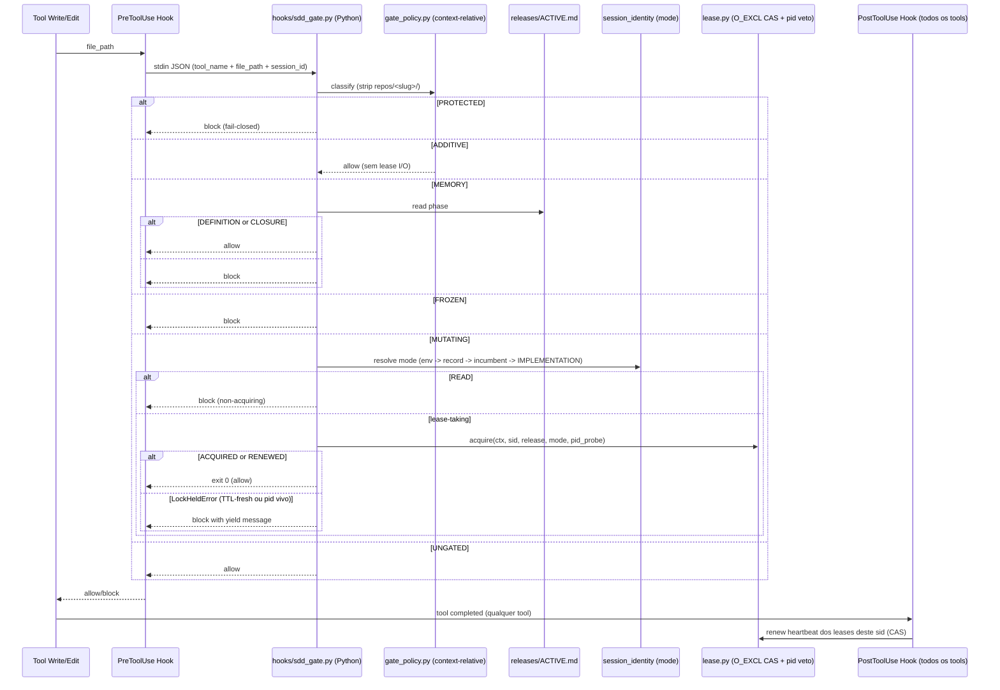

Assets: `python -m dadaia_workspace.hooks.sdd_gate` (PreToolUse, write tools) · `python -m dadaia_workspace.hooks.sdd_post_gate` (PostToolUse, heartbeat) · `python -m dadaia_workspace.hooks.root_whitelist` · `python -m dadaia_workspace.hooks.ctx_inject`. Não existem scripts bash de gate — o único shell asset do produto é `pre-push-ci-gate.sh` (git hook).

## Propósito

Par de hooks Python que intercepta invocações de ferramentas em Claude Code,
Codex e OpenCode. `dadaia_workspace.hooks.sdd_gate` decide **allow** ou **block** antes de
writes; `dadaia_workspace.hooks.sdd_post_gate` renova o heartbeat dos leases da sessão
após cada tool call. A política vive em um único lugar
(`features/spec_context/gate_policy.py`); o hook delega, nunca re-deriva.

O classificador é **context-relative**: para um path sob `repos/<slug>/...`, o prefixo
`repos/<slug>/` é removido e a taxonomia ordenada `specs/` é aplicada ao restante — a
mesma que governa paths workspace-root. Um restante in-repo sem classe é MUTATING
(nunca UNGATED).

| Classe | Paths | Decisão |
|--------|-------|---------|
| PROTECTED | `.dadaia/sessions/**` (workspace-root) | Block sempre — único caminho fail-closed (SEC-01); avaliado primeiro |
| ADDITIVE | `specs/backlog/**`, `specs/bugs/**`, `specs/audits/**` (root **e** in-repo); `.dadaia/reports/**`, `.dadaia/handoff/**`, `.dadaia/tmp/**` (root) | Allow — zero leitura/escrita de lease |
| MEMORY | `specs/memory/**` (root **e** in-repo) | Allow apenas em fase DEFINITION ou CLOSURE; block caso contrário |
| FROZEN | `specs/_archive/**` (root **e** in-repo) | Block sempre |
| MUTATING | `specs/releases/**`, production tree, e todo in-repo path sem classe | READ-mode ⇒ block non-acquiring; senão acquire do lease (O_EXCL CAS + pid veto); block em live-lease conflict |
| UNGATED | Demais paths workspace-root (ex. fora de specs/.dadaia) | Allow |

**Regras (o que o gate realmente enforça):**
- **RULE A (memory atomicity):** `specs/memory/**` fora de DEFINITION/CLOSURE → block. O gate classifica apenas por **path**, nunca por formato/extensão — a proibição de formatos legados `.html`/`.yaml`/`.yml` em memory é lei de formato committed (constitution §3, verificada post-hoc pelo `dadaia specs doctor`), não mecanismo do gate.
- **RULE B (archive read-only):** `specs/_archive/**` → block sempre — inclusive in-repo.
- **RULE READ (mode channel):** sessão com modo resolvido READ/BOUND_READ é non-acquiring — write MUTATING bloqueado **antes** de qualquer chamada ao lease; ADDITIVE flui. Resolução de modo: `DADAIA_MODE` env (escape de operador) → `mode` do session record keyed pelo sid harness-native (vence o incumbent) → modo do **incumbent do contexto** (`sessions/runtime/<ctx>.ptr`, atualizado pelo `bind` — o caminho harness-real do fluxo default; ignorado se um lease vivo nomeia outro sid, anti-downgrade guard) → default `IMPLEMENTATION`.
- **PROTECTED (SEC-01):** `.dadaia/sessions/**` é CLI-owned; block incondicional protege o `.ptr` de forgery.

**O que NÃO é mecanismo do gate (disciplina de agente/PM):** o gate não lê `TASKS.md`,
não verifica `**Status:** Aprovado`, não verifica markers `[-]`, e não valida
`paths.write_allowlist` de personas. Essas leis são disciplina coordenada
(workspace-protocol, dadaia-task-manager) com verificação post-hoc por reviewers e
`dadaia specs doctor`. O envelope determinístico cobre apenas file-write tools
(Claude `Edit|Write|MultiEdit|NotebookEdit`; Codex `apply_patch|Edit|Write`); writes
via Bash ficam fora do envelope (Decision D-2) — o backstop é a coerência
lease↔session do doctor (SPEC-DOC-029).

Fail-open permanece para crashes internos do hook e para MUTATING sem contexto
resolvível; PROTECTED é a única classe fail-closed.

## Acquire do lease (O_EXCL CAS + stable-session-identity)

Para writes MUTATING lease-taking, o gate chama `lease.acquire(ctx, session_id,
release, mode, pid_probe)` (in-process; o pid-probe `OsProcessProbe` é injetado pelo
hook — `features/lease.py` nunca importa o adapter). O acquire usa O_EXCL sentinel file
(único caminho — sem read-then-write TOCTOU); o `renew_heartbeat` roda dentro do mesmo
CAS. O record carrega `pid` — o do **processo harness de vida longa**, resolvido por
`sdd_gate._resolve_holder_pid` (`harness_pid`/`parent_pid`/`ppid` do payload stdin,
senão `os.getppid()`) e threaded até `lease.acquire`; nunca o pid do subprocesso
efêmero do hook. Decision tree:

1. `.ptr` match → **RENEW** incondicional (incumbente, mesmo após relaunch).
2. Record com mesmo `session_id` → **RENEWED**, mesmo past-TTL (holder-safe: um holder nunca perde o próprio lease pela própria staleness).
3. Record ausente, ou TTL-stale com pid do holder morto/ausente → **ACQUIRED** (takeover).
4. Record foreign vivo — TTL-fresh **ou** TTL-stale com pid vivo (**PID veto**, `core/lock_liveness.is_stale`) → **LockHeldError**; gate bloqueia com yield message. A mensagem informa holder e heartbeat e **nunca** instrui rebind, relaunch ou steal.

**Heartbeat (PostToolUse):** `sdd_post_gate` resolve o session id do **payload stdin**
(harness-native; `DADAIA_SESSION_ID` é só override de operador) e renova o heartbeat de
todo lease cujo record nomeia esse sid — nunca via `DADAIA_CONTEXT`→first-ALIVE. Roda
fora de qualquer guard de session-file; fail-open exit 0. No Claude Code o matcher é
match-all `*`; no Codex o bloco PostToolUse vem **sem** matcher (a forma canônica
match-all do Codex) — em ambos, heartbeat após **todo** tool, incl. Bash: um holder em
pytest longo renova entre as calls, e uma única call acima do TTL é coberta pelo PID
veto (pid harness vivo ⇒ block, não steal).

**Canonical unblock:** se o gate bloqueia com live-foreign lease, a sessão aguarda o
holder terminar ou morrer — um holder morto é liberado por TTL+probe no próximo acquire.
Nenhuma ação manual é necessária; writes ADDITIVE seguem fluindo.

## Fluxo de uso

1. Agente invoca uma tool de escrita (ex. `Write` em `repos/<slug>/src/foo.py`).
2. O harness executa `python -m dadaia_workspace.hooks.sdd_gate` passando JSON em stdin com `tool_name`, `file_path` e `session_id`.
3. O gate resolve workspace root, deriva o context slug **PATH-first** do write target (env `DADAIA_CONTEXT` só como override sem repo no path), lê `releases/ACTIVE.md` do contexto para a fase, resolve o session id do stdin e o modo (env → session record → incumbent do contexto → IMPLEMENTATION).
4. O classificador context-relative determina a classe do path.
5. Para MUTATING: READ-mode bloqueia non-acquiring; senão `lease.acquire` com pid-probe.
6. Allow → exit 0 (silencioso); Block → STDOUT JSON `{"decision":"block","reason":"..."}`.
7. Após cada tool call (PostToolUse), `sdd_post_gate` renova o heartbeat dos leases deste sid atomicamente.

## Trigger típico

Automaticamente invocado a cada Write/Edit/MultiEdit/NotebookEdit em sessões de agente (PreToolUse) e após cada tool call (PostToolUse para heartbeat). Operador raramente interage diretamente — só quando recebe um `{"decision":"block"}` que precisa ser entendido.

## Diferencial

Sem este gate, agentes podem escrever em qualquer lugar a qualquer momento — memory vira changelog, archive ganha edits acidentais, dois agentes mutam o mesmo contexto simultaneamente. A classificação context-relative faz as classes ADDITIVE/MEMORY/FROZEN valerem onde os specs reais vivem (`repos/<slug>/specs/`); o PID veto garante que um holder vivo ocupado nunca tem o lease roubado; o heartbeat harness-native mantém o lease fresco durante operações longas; e sessões READ são estruturalmente incapazes de tomar um lease. Leases de sessões mortas são liberados automaticamente por TTL + probe.

## Estado runtime tocado

  * Read-only pelo PreToolUse gate: `releases/ACTIVE.md` do contexto (fase/release), `.dadaia/sessions/<id>.json` (modo via `session_identity`).
  * Read-write (in-process via `lease.py`): `.dadaia/states/ctx_locks/<ctx>.lock.json`, `.dadaia/states/ctx_locks/<ctx>.lock.sentinel`, `.dadaia/sessions/runtime/<ctx>.ptr`.
  * Write pelo PostToolUse gate: renew heartbeat dos lock records deste sid; refresh best-effort de `last_seen_at` no session record.
  * Logs: `.dadaia/logs/lock-events.jsonl` (append-only; eventos acquire, release, steal, HEARTBEAT com `leases_renewed`).
  * Saída: STDOUT JSON quando bloqueia; exit 0 (silencioso) quando permite.

## Dependências

  * Depende de [[context-management]] (session record persistido por `dadaia context bind`; lease records criados pelo acquire inline).
  * `features/spec_context/session_identity.py` — único owner dos pointers e session records que o gate e o post-gate consomem.
  * `infrastructure/process_probe_adapter.OsProcessProbe` (platform seam `has_os_kill_liveness`) — injetado pelo hook; fallback TTL-only quando indisponível.
  * Depende de [[agent-orchestration]] indiretamente (releases ativas geradas pelo product-engineer durante orchestration).
  * Variáveis de ambiente (apenas overrides de operador; nenhuma é requerida em harness real): `WORKSPACE_ROOT`, `DADAIA_CONTEXT`, `DADAIA_SESSION_ID`, `DADAIA_MODE`.

### Hook injection por runtime

Runtime| PreToolUse| PostToolUse| Observação
---|---|---|---
Claude Code| `.claude/settings.json` `hooks.PreToolUse[*]` matcher `Edit\|Write\|MultiEdit\|NotebookEdit`| `hooks.PostToolUse[*]` matcher `*` (todos os tools)| `python -m dadaia_workspace.hooks.sdd_gate`; Python puro (Windows/macOS/Linux); instalado via `dadaia public install --target claude`
Codex| `.codex/hooks.json` `PreToolUse` matcher `^(apply_patch\|Edit\|Write)$`| `PostToolUse` **sem matcher** (forma canônica match-all do Codex — heartbeat em todos os tools, incl. Bash)| `SessionStart` (matcher `startup\|resume`) injeta o contexto uma vez por sessão via ctx_inject
OpenCode| Plugin TS `sdd-gate.ts` (`tool.execute.before`) chama os hooks Python via subprocess| sem post-hook separado (doctor reporta `[unsupported]` — esperado)| venv-path resolution `.dadaia/.venv/bin/python` → `Scripts/python.exe` → `python`
