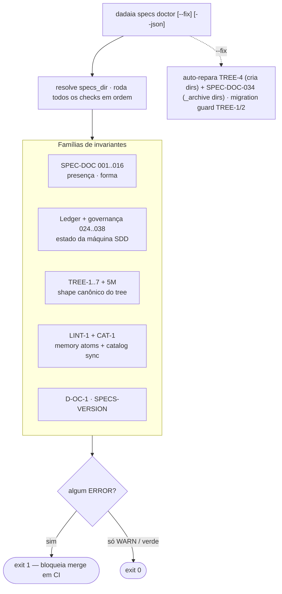

CLI surface: `dadaia specs doctor [--specs-dir PATH] [--json] [--fix]` · Closure: v0.2.1

## Propósito

Valida invariantes estruturais do diretório `specs/` sob o modelo SDD release-lifecycle. Grupos de checks:

  * **SPEC-DOC estruturais** (IDs não-sequenciais vivos: 001, 002, 002L, 003, 004, 005, 006, 007, 008 refs de imagem, 009, 012, 016): presença de `constitution.md`, memory `.md` com folder catalog em `product/`, `ACTIVE.md` bem formada, status canônicos, PLAN ≤ 300 linhas, CLOSURE com evidence triples, atomicidade do memory sem changelog (check #8 greppa o corpo `.md`), links de imagem resolvendo, schema de backlog (o check 012 embute as regras **022** — formato dos bullets de `## Hotfixes pendentes` — e **023** — bullet de hotfix stale > 72h), **SPEC-DOC-002L** (stray `.html` sob `specs/memory/` devem ser deletados), e **D-OC-1** (bidirectional orchestration registry consistency). Os ids 010/011/013/014/015/025 não existem (aposentados/absorvidos).
  * **Ledger + governança** (024, 026..038): ver a tabela abaixo.
  * **SPECS-VERSION**: WARN quando o `specs_pattern_version` da árvore está abaixo do canônico da lib — recomenda `dadaia specs upgrade`.
  * **TREE-1..7 + TREE-5M**: canonical `specs/` tree v2 shape. TREE-3 exige `specs/memory/quality-assurance.md` no top-level. O check de `specs/memory/AGENTS.md` é **TREE-5M**. CAT-1 e SPEC-DOC-002 usam `rglob` para atoms nested.
  * **LINT-1 + CAT-1**: memory atoms (lint script) + sync do `catalog.json`.

### Ledger invariants (SPEC-DOC-024 + 026..038)

O doctor valida as próprias transições de estado da máquina SDD (a verdade que o gate lê):

Código| O que detecta| Severity| Notas
---|---|---|---
SPEC-DOC-024| `ACTIVE.md phase` incoerente com os markers do TASKS.md ativo: fase SPEC/DEFINITION com maioria `[x]`; IMPLEMENTATION sem TASKS.md `**Status:** Aprovado`; CLOSURE com task não-`[x]`| ERROR| Constitution §7; suporta `segment:`
SPEC-DOC-026| Release id duplicado entre `releases/` e `_archive/releases/` (recursivo)| ERROR (WARN se envolve dir legacy documentado)| Mata a ambiguidade de arqueologia de archive
SPEC-DOC-027| Nome de release dir fora do canon `^v\d+\.\d+\.\d+$`| ERROR para release viva criada após o cutoff; silencioso para os dirs legacy pré-canon enumerados na allowlist documentada no source (sem renames de história arquivada); WARN para legacy fora da allowlist| Alinha com SPEC-DOC-016; enforcement forward intacto para dirs novos
SPEC-DOC-028| Referência backtick path-like em `constitution.md` que não resolve no repo root| WARN| Só refs com `/`; no-op sem `repo_root` injetado
SPEC-DOC-029| Coerência lease↔session em triagem de **3 estados**: (a) lease TTL-expirado com holder morto/unprobeable ⇒ WARN "stale lease from a dead session — safe to reclaim" nomeando a remediação (`dadaia doctor --fix` / `dadaia lock steal <ctx>`); (b) holder **vivo** + incoerência lease↔session genuína ⇒ ERR (única sede da linguagem de forgery); (c) coerente ⇒ silencioso| WARN (a) / ERROR (b)| Backstop D-2; liveness via `lease.is_held` (TTL piso + pid veto); pid-probe **composition-root-wired** (a CLI injeta via o seam do hook layer; default `None` ⇒ TTL-only); lê os records reais `<ctx>.lock.json` via `session_identity.coherence`; só roda com `workspace_state_dir` injetado
SPEC-DOC-030| Diretório novo em `specs/audits/` fora do canon `<YYYYMMDDTHHMMSSZ>-<sid8>` (exceto os 4 dirs grandfathered no §8 da constitution e `_archive/`)| WARN| Constitution §8 naming law (amendment 2026-06-10); enforcement forward-only
SPEC-DOC-031| Entry em `specs/backlog/**` com status **não-terminal** ({OPEN, PICKED, CANDIDATE}, prefix match case-insensitive na Status line) cujo slug/ID aparece em CLOSURE/SPEC de release **arquivada**, fora de seções "Backlog returns"| WARN| Vocabulário ADR-11 (v0.1.11): terminal = {DELIVERED, SUPERSEDED, RESOLVED, CONSUMED, DEFERRED, REJECTED}, sufixos permitidos (`— vX.Y.Z`); falso-positivo conhecido: menções defer/supersede em CLOSUREs arquivadas — razão de ser WARN, não ERR
SPEC-DOC-032| Arquivo `.md` LEGADO em `specs/bugs/**` com `status:` fora do canon {`Open`, `Closed`}| WARN| Aplica-se só a fontes Markdown legadas; o caminho canônico de bugs é o event store JSONL (033)
SPEC-DOC-033| Event store JSONL de bugs: linha inválida contra `bug-event-v1`; arquivo acima do rotation ceiling; terminal sem `reported` prévio ou terminal duplo por `bug_id` (`archived` ignorado — não-terminal; `reported` reabre)| ERROR| Varre `specs/bugs/*.jsonl` (não-recursivo; `_archive/` excluído) — [[sdd-bug-backlog-governance]]
SPEC-DOC-034| Um dos três `_archive/` per-artifact (`backlog/`, `bugs/`, `audits/`) ausente| WARNING| **auto-fix**: `--fix` cria o dir com `.gitkeep`
SPEC-DOC-035| Entry de backlog com status terminal ainda loose (não movido para `specs/backlog/_archive/`)| WARN| Disposição terminal ⇒ archive move
SPEC-DOC-036| Audit arquivado em `specs/audits/_archive/` sem nomear a release que o dispôs| WARNING| Audit-disposition law
SPEC-DOC-037| `constitution.md` enumera membro de `AgentRuntimeKind` / roster de harness (token uppercase word-bounded)| ERROR| A constitution declara o invariante e cita `[[tech-stack]]`; guard de recorrência do rewrite
SPEC-DOC-038| Diretório de audit loose direto sob `specs/audits/` (fora de `_archive/`)| WARNING| Um WARN por audit não-disposto — visível até a release de remediação arquivá-lo

Exit code 1 se houver errors; 0 se só warnings ou tudo verde. Suporta `--json` para integração com CI/automação e `--fix` para auto-repair dos invariantes tratáveis.

### Invariante LINT-1 (memory-markdown-source-v1)

Código| O que detecta| Severity| Notas
---|---|---|---
LINT-1| Qualquer atom `.md` em `specs/memory/` ou `specs/memory/product/` falha validação de `lint-memory-atoms.py`| ERROR (frontmatter) / WARN (token drift)| Frontmatter: required fields, no extra fields, forbidden headings, wikilink resolution. Token drift: `words × 1.35` vs `token_estimate` > 20% → WARN
SPEC-DOC-002| Check #2: memory files existem como `.md`| ERROR| Agora requer `.md`, não `.html`; aceita headings `##` conforme allowlist
SPEC-DOC-002L| Stray `.html` presentes sob `specs/memory/`| ERROR| Esses arquivos devem ser deletados; D-4 proíbe HTML commitado na pasta memory
SPEC-DOC-008| Byte-identity do HTML commitado| —| **Removido** — não aplicável ao modelo MD-source (D-4: HTML é efêmero, renderizado in-memory)

### Invariantes TREE-1..7 + TREE-5M (canonical tree v2, pós v0.2.1)

Código| O que detecta| Severity| `--fix` policy
---|---|---|---
TREE-1| Diretório `specs/foundation/` presente (depreciado)| WARN| warn-only; **migration guard** impresso independente de `--fix` — instrução: `dadaia migrate tree-v2`
TREE-2| Arquivo `specs/SPEC.md` na raiz (pre-release-model)| WARN| warn-only; **migration guard** impresso — instrução: `dadaia migrate tree-v2`
TREE-3| Memory `.md` atom obrigatório ausente — checa `memory/architecture.md`, `memory/tech-stack.md`, `memory/quality-assurance.md` (top-level, pós v0.2.1) e `memory/product/index.md`| WARNING| **no-fix** (warn-only): atoms `.md` são operator-authored, não gerados de template — `--fix` não os recria
TREE-4| Um ou mais de `specs/backlog/`, `specs/bugs/`, `specs/releases/`, `specs/audits/` ausentes| WARNING| **auto-fix** : recria diretório(s) ausente(s) com README.md + `.gitkeep` (quando há scaffold source; senão warn "create manually")
TREE-5| `specs/AGENTS.md` ausente (drift em relação ao template canônico)| WARN| warn-only (sem auto-overwrite — arquivo pode ter customizações do consumer)
TREE-5M| `specs/memory/AGENTS.md` ausente| WARN| warn-only (projetado via `dadaia public install` — WS-2)
TREE-6| Diretório de release em `specs/releases/` sem pelo menos um artefato SDD obrigatório (`SPEC.md`)| ERROR| no-fix (decisão humana)
TREE-7| Arquivo de bug em `specs/bugs/` sem campo `session_id` no frontmatter| ERROR| no-fix (campo requer valor real)

**Migration guard (TREE-1/2):** quando detectados, o doctor imprime a mensagem de migration guard independentemente do flag `--fix` — o auto-move de `foundation/` e root `SPEC.md` para `releases/legacy/` é feito exclusivamente por `dadaia migrate tree-v2`.

## Fluxo de uso

  1. `dadaia specs doctor` — resolve `specs_dir` via `--specs-dir` ou contexto de sessão bound (fallback persistido de bind: env → incumbent atribuível/vivo → cwd), roda todos os checks em ordem, exibe issues formatados com código + severity + path. LINT-1 invoca `lint-memory-atoms.py` nos átomos `.md`; token drift é WARN; violações de frontmatter ou heading proibido são ERROR.
  2. `dadaia specs doctor --fix` — executa os checks e auto-repara os DOIS invariantes com policy `auto-fix`: **TREE-4** (recria diretórios de lifecycle ausentes) e **SPEC-DOC-034** (cria `_archive/` per-artifact ausente com `.gitkeep`); emite migration guard para TREE-1/2; deixa TREE-3 e TREE-5..7 como warnings/errors sem alterar arquivos (TREE-3 é warn-only — atoms `.md` são operator-authored, não gerados).
  3. Para automação: `dadaia specs doctor --json` emite payload `{specs_dir, issues[], summary{errors, warnings}}`.
  4. Em CI: usado como gate de PR para bloquear merge se houver erros estruturais nos specs.

Inventário vivo de códigos: `SPEC-DOC-001..009`, `012`, `016` (+ regras 022/023 dentro do 012; sufixo `L` para legacy — `002L`) + ledger/governança `SPEC-DOC-024`, `026..038` + `SPECS-VERSION` + `D-OC-1` + `TREE-1..7` + `TREE-5M` + `LINT-1` + `CAT-1`. `--fix` repara TREE-4 e SPEC-DOC-034. Os códigos de GC de runtime (`LOCK-GC`, `CTX-URL-1`, etc.) pertencem ao [[workspace-doctor]], não a este.

## Trigger típico

CI gate antes de merge; manualmente após qualquer movimentação grande de specs (migração, archive, criação de release nova) para confirmar que a estrutura ainda está sã.

## Diferencial

Sem este validador, drift entre modelo SDD e a realidade no disco vira bug latente — memory virando changelog, releases sem CLOSURE, status não-canônicos passando despercebidos. Os checks são post-hoc (não bloqueiam edição como o gate faz) mas detectam violações que o gate não consegue capturar (por exemplo, conteúdo de CLOSURE.md, broken images, link integrity).

## Estado runtime tocado

  * Read-only sobre todo `specs_dir` (modo padrão).
  * **Com`--fix`:** escreve em `specs_dir` apenas para os dois invariantes com policy `auto-fix`: TREE-4 (recria diretórios de lifecycle ausentes com README/`.gitkeep`) e SPEC-DOC-034 (cria os `_archive/` per-artifact ausentes com `.gitkeep`). TREE-3 (memory atoms ausentes) é warn-only — não é recriado por `--fix`, pois atoms `.md` são operator-authored. Todos os outros invariantes permanecem read-only mesmo com `--fix`.

## Dependências

  * Resolução de `specs_dir`: [[context-management]] (via explicit flag or session-bound context).
  * Complementar a [[sdd-gate-v3]] (gate previne writes inválidos; doctor detecta inconsistências post-hoc).
  * Complementar a [[workspace-doctor]] (workspace state vs specs structure).
