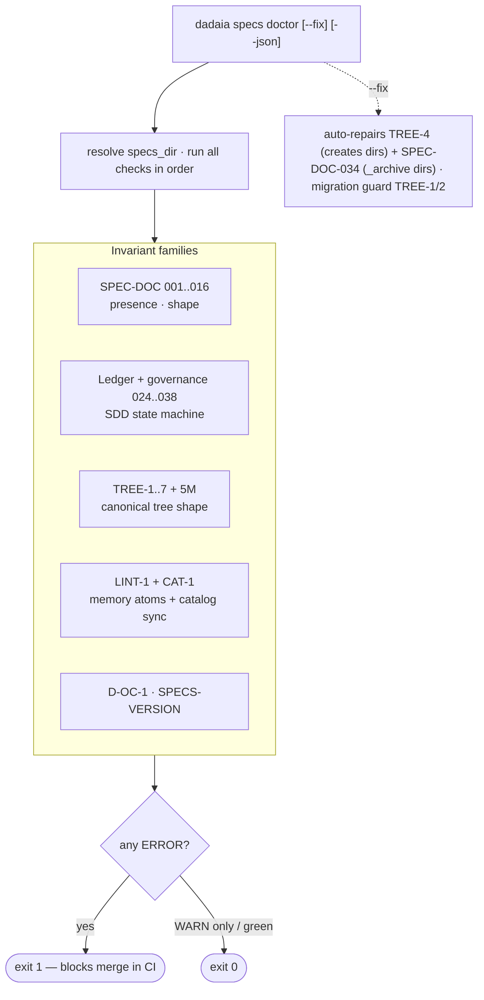

CLI surface: `dadaia specs doctor [--specs-dir PATH] [--json] [--fix]` · Closure: v0.2.1

## Purpose

Validates structural invariants of the `specs/` directory under the SDD release-lifecycle model. Check groups:

  * **Structural SPEC-DOC** (live non-sequential IDs: 001, 002, 002L, 003, 004, 005, 006, 007, 008, 009, 012, 016): presence of `constitution.md`, memory `.md` with a folder catalog in `product/`, well-formed `ACTIVE.md`, canonical statuses, PLAN ≤ 300 lines, CLOSURE with evidence triples, **008** — memory atomicity: forbidden changelog/history `##` headings in the `.md` body (check #8 greps the body; ERROR), backlog schema (check 012 embeds rules **022** — the format of `## Hotfixes pendentes` bullets — and **023** — hotfix bullet stale > 72h; 022/023 are never emitted as their own codes), **SPEC-DOC-002L** (stray `.html` under `specs/memory/` must be deleted), and **D-OC-1** (bidirectional orchestration registry consistency). Ids 010/011 are retired no-op stubs (HTML-era image-link/mermaid checks); 013/014/015/025 do not exist (retired/absorbed).
  * **Ledger + governance** (024, 026..038): see the table below.
  * **SPECS-VERSION**: WARN when the tree's `specs_pattern_version` is below the library's canonical one — recommends `dadaia specs upgrade`.
  * **TREE-1..7 + TREE-5M**: canonical `specs/` tree v2 shape. TREE-3 requires `specs/memory/quality-assurance.md` at the top level. The `specs/memory/AGENTS.md` check is **TREE-5M**. CAT-1 and SPEC-DOC-002 use `rglob` for nested atoms.
  * **LINT-1 + CAT-1**: memory atoms (lint script) + `catalog.json` sync.

**Module structure (v0.1.55).** `dadaia specs doctor` is implemented as a **thin `SpecsDoctor` coordinator** (`features/specs/doctor.py`, 224 lines) that owns `check()`/`fix()` ORDER and delegates the validation LOGIC to six single-responsibility sibling validator classes — `doctor_structural` (TREE-*, required dirs, agents.md, `fix_tree4`), `doctor_memory` (memory files/atomicity/image-links/mermaid, LINT-1, CAT-1, SPEC-DOC-008 — holds the lazy `infrastructure.subprocess_runner` import), `doctor_release` (ACTIVE.md, active-release artifacts, plan-line limit, phase markers, uniqueness/naming/semver), `doctor_closure_audit` (archive closures, `fix_archive_dir`, audit disposition 036/038, no-orphan-specs), `doctor_governance` (bug-status canon, bugs-JSONL invariant 033, backlog schema 031/035, consumed-backlog disposition), and `doctor_coherence` (constitution refs 028, no-runtime-enum 037, orchestration registry D-OC-1, specs-pattern-version, lease/session coherence 029 — holds the `spec_context.{lease,session_identity}` import) — over two shared leaf modules `doctor_types.py` (`Severity`/`SpecsDoctorIssue`/`_MemoryMdSummary` + the `PidProbe` leaf alias) and `doctor_common.py` (five cross-validator pure helpers). `check()` invokes the validators' public methods in the exact original interleaved order (pinned by a deterministic golden — clock frozen + `<SPECS>`-normalized paths); `fix()` dispatches by issue code (`TREE-4 → structural.fix_tree4`, `SPEC-DOC-034 → closure_audit.fix_archive_dir`). Decomposed in v0.1.55, golden byte-identical; the code inventory below is unchanged. A `test_module_size_ceiling` ratchet caps each `doctor*.py` at 700 lines.

### Ledger invariants (SPEC-DOC-024 + 026..038)

The doctor validates the SDD state machine's own transitions (the truth the gate reads):

Code| What it detects| Severity| Notes
---|---|---|---
SPEC-DOC-024| `ACTIVE.md phase` incoherent with the active TASKS.md markers: SPEC/DEFINITION phase with a `[x]` majority; IMPLEMENTATION without TASKS.md `**Status:** Aprovado`; CLOSURE with a non-`[x]` task| ERROR| Constitution §7; supports `segment:`
SPEC-DOC-026| Duplicate release id between `releases/` and `_archive/releases/` (recursive)| ERROR (WARN if a documented legacy dir is involved)| Kills archive-archaeology ambiguity
SPEC-DOC-027| Release dir name outside the canon `^v\d+\.\d+\.\d+$`| ERROR for a live release created after the cutoff; silent for the pre-canon legacy dirs enumerated in the allowlist documented in source (no renames of archived history); WARN for legacy outside the allowlist| Aligns with SPEC-DOC-016; forward enforcement intact for new dirs
SPEC-DOC-028| Path-like backtick reference in `constitution.md` that does not resolve at the repo root| WARN| Only refs with `/`; no-op without an injected `repo_root`
SPEC-DOC-029| Lease↔session coherence in a **3-state** triage: (a) TTL-expired lease with a dead/unprobeable holder ⇒ WARN "stale lease from a dead session — safe to reclaim" naming the remediation (`dadaia doctor --fix` / `dadaia lock steal <ctx>`); (b) **live** holder + genuine lease↔session incoherence ⇒ ERR (the only seat of the forgery language); (c) coherent ⇒ silent| WARN (a) / ERROR (b)| Backstop D-2; liveness via `lease.is_held` (TTL floor + pid veto); pid-probe **composition-root-wired** (the CLI injects it via the hook layer's seam; default `None` ⇒ TTL-only); reads the real `<ctx>.lock.json` records via `session_identity.coherence`; only runs with an injected `workspace_state_dir`. **Holder-confirmation (v0.1.50):** a holder whose sid carries same-CAS by-session index evidence (`lease.session_holds`) is **coherent even when the `.ptr` drifted** — the index entry is written in the SAME O_EXCL CAS as the record, so it cannot be forged out-of-band; only an evidence-less record (no index entry for its sid) can still raise the live-incoherent ERR. A `--specs-dir` run outside the workspace isolates `workspace_state_dir = None` — no state bleed from the invoking workspace
SPEC-DOC-030| New directory in `specs/audits/` outside the canon `<YYYYMMDDTHHMMSSZ>-<sid8>` (except the 4 dirs grandfathered in constitution §8 and `_archive/`)| WARN| Constitution §8 naming law (amendment 2026-06-10); forward-only enforcement
SPEC-DOC-031| Entry in `specs/backlog/**` with a **non-terminal** status ({OPEN, PICKED, CANDIDATE}, case-insensitive prefix match on the Status line) whose slug/ID appears in the CLOSURE/SPEC of an **archived** release, outside "Backlog returns" sections| WARN| ADR-11 vocabulary (v0.1.11): terminal = {DELIVERED, SUPERSEDED, RESOLVED, CONSUMED, DEFERRED, REJECTED}, suffixes allowed (`— vX.Y.Z`); known false positive: defer/supersede mentions in archived CLOSUREs — the reason it is WARN, not ERR
SPEC-DOC-032| LEGACY `.md` file in `specs/bugs/**` with a `status:` outside the canon {`Open`, `Closed`}| WARN| Applies only to legacy Markdown sources; the canonical bug path is the JSONL event store (033)
SPEC-DOC-033| Bug JSONL event store: line invalid against `bug-event-v1`; file above the rotation ceiling; terminal without a prior `reported` or double terminal per `bug_id` (`archived` ignored — non-terminal; `reported` reopens)| ERROR| Scans `specs/bugs/*.jsonl` (non-recursive; `_archive/` excluded) — [[sdd-bug-backlog-governance]]
SPEC-DOC-034| One of the three per-artifact `_archive/` dirs (`backlog/`, `bugs/`, `audits/`) missing| WARNING| **auto-fix**: `--fix` creates the dir with `.gitkeep`
SPEC-DOC-035| Backlog entry with a terminal status still loose (not moved to `specs/backlog/_archive/`)| WARN| Terminal disposition ⇒ archive move
SPEC-DOC-036| Archived audit in `specs/audits/_archive/` that does not name the release that dispositioned it| WARNING| Audit-disposition law
SPEC-DOC-037| `constitution.md` enumerates an `AgentRuntimeKind` member / harness roster (uppercase word-bounded token)| ERROR| The constitution declares the invariant and cites `[[tech-stack]]`; recurrence guard for the rewrite
SPEC-DOC-038| Loose audit directory directly under `specs/audits/` (outside `_archive/`)| WARNING| One WARN per undispositioned audit — visible until the remediation release archives it

Exit code 1 if there are errors; 0 if only warnings or all green. Supports `--json` for CI/automation integration and `--fix` for auto-repair of the treatable invariants.

### LINT-1 invariant (memory-markdown-source-v1)

Code| What it detects| Severity| Notes
---|---|---|---
LINT-1| Any `.md` atom in `specs/memory/` or `specs/memory/product/` fails `lint-memory-atoms.py` validation| ERROR (frontmatter) / WARN (token drift)| Frontmatter: required fields, no extra fields, forbidden headings, wikilink resolution. Token drift: `words × 1.35` vs `token_estimate` > 20% → WARN. Heading allowlist = curated groups ∪ the optional workspace file `specs/memory/.heading-allowlist` (v0.1.49: one exact heading per line, `#` comments ignored — consumers extend without editing the lib-originated script; the file is MEMORY-class, so edit in DEFINITION/CLOSURE)
SPEC-DOC-002| Check #2: memory files exist as `.md`| ERROR| Now requires `.md`, not `.html`; accepts `##` headings per the allowlist
SPEC-DOC-002L| Stray `.html` present under `specs/memory/`| ERROR| Those files must be deleted; D-4 forbids committed HTML in the memory folder
SPEC-DOC-008| **Live**: forbidden changelog/history `##` heading (`Changelog`/`History`/`Histórico`/`Versions`) in a memory `.md` body — memory atoms must be atomic, not changelogs (LOGIC in the `doctor_memory` validator; coordinator check-order position #8)| ERROR| The retired HTML-era checks are #10 (image links) and #11 (mermaid script), now no-op stubs; the removed HTML byte-identity check was never 008

### TREE-1..7 + TREE-5M invariants (canonical tree v2, post v0.2.1)

Code| What it detects| Severity| `--fix` policy
---|---|---|---
TREE-1| `specs/foundation/` directory present (deprecated)| WARN| warn-only; **migration guard** printed regardless of `--fix` — instruction: `dadaia migrate tree-v2`
TREE-2| `specs/SPEC.md` file at the root (pre-release-model)| WARN| warn-only; **migration guard** printed — instruction: `dadaia migrate tree-v2`
TREE-3| Required memory `.md` atom missing — checks `memory/architecture.md`, `memory/tech-stack.md`, `memory/quality-assurance.md` (top-level, post v0.2.1) and `memory/product/index.md`| WARNING| **no-fix** (warn-only): `.md` atoms are operator-authored, not template-generated — `--fix` does not recreate them
TREE-4| One or more of `specs/backlog/`, `specs/bugs/`, `specs/releases/`, `specs/audits/` missing| WARNING| **auto-fix**: recreates the missing directory(ies) with README.md + `.gitkeep` (when a scaffold source exists; else warn "create manually")
TREE-5| `specs/AGENTS.md` missing (drift from the canonical template)| WARN| warn-only (no auto-overwrite — the file may carry consumer customizations)
TREE-5M| `specs/memory/AGENTS.md` missing| WARN| warn-only (projected via `dadaia public install` — WS-2)
TREE-6| Release directory in `specs/releases/` without at least one required SDD artifact (`SPEC.md`)| ERROR| no-fix (human decision)
TREE-7| Bug file in `specs/bugs/` without a `session_id` frontmatter field| ERROR| no-fix (field requires a real value)

**Migration guard (TREE-1/2):** when detected, the doctor prints the migration-guard message regardless of the `--fix` flag — the auto-move of `foundation/` and root `SPEC.md` to `releases/legacy/` is done exclusively by `dadaia migrate tree-v2`.

## Usage flow

  1. `dadaia specs doctor` — resolves `specs_dir` via `--specs-dir` or the session's bound context (persisted bind fallback: env → attributable/live incumbent → cwd), runs all checks in order, prints formatted issues with code + severity + path. LINT-1 invokes `lint-memory-atoms.py` on the `.md` atoms; token drift is WARN; frontmatter violations or a forbidden heading are ERROR.
  2. `dadaia specs doctor --fix` — runs the checks and auto-repairs the TWO invariants with `auto-fix` policy: **TREE-4** (recreates missing lifecycle directories) and **SPEC-DOC-034** (creates the missing per-artifact `_archive/` with `.gitkeep`); prints the migration guard for TREE-1/2; leaves TREE-3 and TREE-5..7 as warnings/errors without changing files (TREE-3 is warn-only — `.md` atoms are operator-authored, not generated).
  3. For automation: `dadaia specs doctor --json` emits a `{specs_dir, issues[], summary{errors, warnings}}` payload.
  4. In CI: used as a PR gate to block merge if there are structural errors in the specs.

Live code inventory: `SPEC-DOC-001..009`, `012`, `016` (+ rules 022/023 inside 012; `L` suffix for legacy — `002L`) + ledger/governance `SPEC-DOC-024`, `026..038` + `SPECS-VERSION` + `D-OC-1` + `TREE-1..7` + `TREE-5M` + `LINT-1` + `CAT-1`. `--fix` repairs TREE-4 and SPEC-DOC-034. The runtime GC codes (`LOCK-GC`, `CTX-URL-1`, etc.) belong to the [[workspace-doctor]], not to this one.

## Typical trigger

CI gate before merge; manually after any large specs movement (migration, archive, new release creation) to confirm the structure is still sane.

## Differentiator

Without this validator, drift between the SDD model and the on-disk reality becomes a latent bug — memory turning into a changelog, releases without CLOSURE, non-canonical statuses going unnoticed. The checks are post-hoc (they do not block editing the way the gate does) but they detect violations the gate cannot capture (for example, CLOSURE.md content, broken images, link integrity).

## Runtime state touched

  * Read-only over the whole `specs_dir` (default mode).
  * **With `--fix`:** writes into `specs_dir` only for the two invariants with `auto-fix` policy: TREE-4 (recreates missing lifecycle directories with README/`.gitkeep`) and SPEC-DOC-034 (creates the missing per-artifact `_archive/` dirs with `.gitkeep`). TREE-3 (missing memory atoms) is warn-only — it is not recreated by `--fix`, since `.md` atoms are operator-authored. All other invariants remain read-only even with `--fix`.

## Dependencies

  * `specs_dir` resolution: [[context-management]] (via explicit flag or session-bound context).
  * Complementary to [[sdd-gate-v3]] (the gate prevents invalid writes; the doctor detects inconsistencies post-hoc).
  * Complementary to [[workspace-doctor]] (workspace state vs specs structure).
