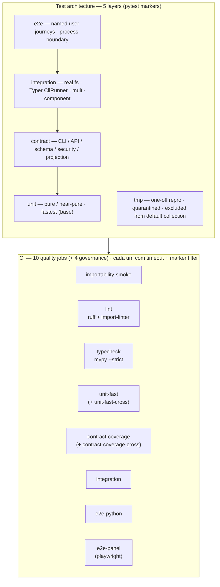

## Propósito

dadaia-workspace uses an enforced five-layer test architecture. The five layers
are: `unit` (pure or near-pure functions, fastest), `contract` (public CLI/API/
schema/security contracts), `integration` (multi-component with real filesystem or
CLI runner), `e2e` (named user journeys, browser or process-boundary), and `tmp`
(one-off debugging reproductions, quarantined and excluded from default collection).

Each layer has a machine-readable pytest marker declared in `pyproject.toml`. The
default local invocation (`pytest`) does not run coverage; coverage is measured only
in CI's dedicated `contract-coverage` job, keeping local runs fast and avoiding
coverage inflation that hides weak contracts.

Os quatro adapters de harness (Codex/Claude-SDK/OpenCode/PI) seguem a mesma taxonomia:
`unit` para construção de comando/parse/redaction/Ring-2, `integration` para projeção
Layer-1 e o seam CLI `--harness`, e um teste `live` **opt-in** (`DADAIA_*_LIVE=1`, nunca
CI-gated) para o binding upstream real.

The no-slop policy is the durable rule that prevents a test pile from accumulating:
no test may be named after a PR, release, or task id; no test may assert that
deleted code remains deleted; private constants must not be duplicated into test
code as the source of truth; one-off debugging tests go to `tests/tmp/` only with
an expiry note.

This atom is the design-of-record for implementers and qa-engineer. It is the
canonical path per constitution §13 (`specs/memory/quality-assurance.md`) and the
normative vision §6.

## Fluxo de uso

1. Developer picks the test layer based on what the test exercises: pure function
   → `unit`; public CLI/schema/security → `contract`; multi-component with real
   filesystem or CLI runner → `integration`; user journey or browser → `e2e`.
2. Test receives the corresponding `@pytest.mark.<layer>` decorator. Any test over
   1 second or that starts a server or subprocess also receives
   `@pytest.mark.slow`.
3. Local fast path: `pytest -q -m "unit and not slow" tests/unit` — runs in under
   10 seconds without coverage instrumentation.
4. CI runs 10 quality jobs: importability-smoke, lint, typecheck, unit-fast,
   unit-fast-cross, contract-coverage, contract-coverage-cross, integration,
   e2e-python, e2e-panel — each with an explicit timeout and a targeted marker
   filter (the `-cross` jobs run the same markers on the Windows/macOS matrix). A
   further 4 governance jobs (pr-title, repo-hygiene, hotfix-branch-name,
   verdict-gate) gate PR shape and the security push verdict.
5. One-off debugging reproductions go to `tests/tmp/` with an expiry note; they
   are never counted toward coverage or release closure and are excluded from
   default collection.

## Trigger típico

Used when implementing a new feature, refactoring a public contract, or reproducing
a CI failure.

## Diferencial

Without the layer taxonomy there is no enforceable boundary between fast pure-unit
tests and slow process-boundary journeys: local runs become slow, coverage
instrumentation in default addopts inflates numbers and hides weak contracts, and
release-history tests accumulate protecting deleted code. The three failure modes
are closed simultaneously by: the layer taxonomy (boundary enforcement via markers),
the CI split into per-layer jobs (each job targets its layer, with its own timeout), and
the no-slop policy (prevents re-accumulation).

## Estado runtime tocado

Files the test suite reads or writes at runtime:

- `pyproject.toml` — pytest configuration, marker declarations, `norecursedirs`,
  coverage data redirect to `/tmp/dadaia-ws-toolcache/coverage/.coverage`.
- `tests/unit/**` — pure or near-pure fast tests; forbidden: CLI runner,
  subprocess, server threads, public stage/install, full workspace init, sleeps.
- `tests/contract/**` — public CLI/API/schema/security/projection contracts;
  forbidden: browser, long journey setup, private implementation matrices.
- `tests/integration/**` — real tmp filesystem, Typer `CliRunner`, multi-component
  service wiring; forbidden: browser, real remotes, duplicate unit matrices.
- `tests/e2e/**` — named user journeys and process-boundary flows; forbidden:
  micro assertions, implementation internals, exhaustive branch matrices.
- `tests/tmp/**` — one-off debugging reproductions only; excluded from default
  collection, CI, and coverage. Each subdirectory must include an expiry note.
- `.github/workflows/ci.yml` — 10 quality jobs (importability-smoke, lint,
  typecheck, unit-fast(+cross), contract-coverage(+cross), integration, e2e-python,
  e2e-panel) consuming the layer-specific pytest commands with explicit timeouts,
  plus 4 governance jobs (pr-title, repo-hygiene, hotfix-branch-name, verdict-gate).
- `tests/conftest.py` — backstop guard preventing real venv creation inside test
  runs; `tmp_path_retention_policy = "failed"`.

## Dependências

- [[specs-doctor]] — `dadaia specs doctor` validates SDD structural invariants;
  the test layer and the specs gate are separate quality gates at different scopes.
- [[public-asset-distribution]] — `tests/contract/test_source_repo_hygiene.py` and
  `tests/unit/features/public/` hold contracts for the public asset pipeline.
- [[agent-comms]] — `tests/contract/test_handoff_schema_contract.py` protects the
  handoff-v1.1 JSON schema contract.
- [[sdd-gate-v3]] — `tests/unit/gate/` and `tests/integration/gate/` hold
  the unit and integration tests for the SDD enforcement gate.
