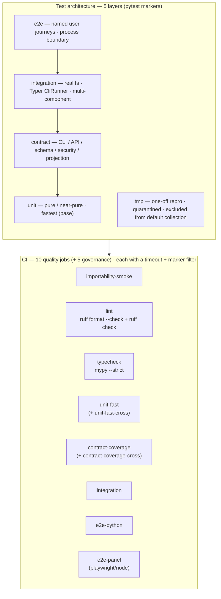

## Purpose

dadaia-workspace uses an enforced five-layer test architecture. The five layers
are: `unit` (pure or near-pure functions, fastest), `contract` (public CLI/API/
schema/security contracts), `integration` (multi-component with real filesystem or
CLI runner), `e2e` (named user journeys, browser or process-boundary), and `tmp`
(one-off debugging reproductions, quarantined and excluded from default collection).

Each layer has a machine-readable pytest marker declared in `pyproject.toml`; test
order is randomized per run by `pytest-randomly` (flushes inter-test order
dependencies). The default local invocation (`pytest`) does not run coverage; the
**only** coverage gate is CI's dedicated `contract-coverage` job
(`--cov-fail-under=80`, a hard gate; `COVERAGE_FILE` redirected to the runner temp
dir), keeping local runs fast and avoiding coverage inflation that hides weak
contracts.

**Coverage-gate scope note (do not slop-fix):** the 80% gate measures **unit+contract
only** (`pytest -m "unit or contract" tests/unit tests/contract`). Modules whose
coverage comes from integration or e2e journeys legitimately read **0%** in the
contract-coverage report — that is the gate working as designed, not a gap. Never
"fix" such a row by adding slop unit tests; the integration/e2e layer is its honest
coverage home.

**Live scale (honest bracket):** the suite collects ≈ 4.9k tests (4,837 passed +
18 skipped as of v0.1.64; grows with every release). Rough layer shape: unit is the large base,
contract and integration are the mid hundreds each, e2e is the small top. Budgets are
brackets, not pins — re-validate against `pytest --collect-only -q | tail -1` at
closure.

**Warning-clean law:** the full unpiped suite runs with **0 warnings** — a warnings
summary in the pytest output is ship-gate evidence, not noise (the last standing
`PytestRemovedIn10Warning`, a class-scoped instance-method fixture in the telemetry
integration tests, was converted to a `@staticmethod` class-scoped fixture in v0.1.61).

**Named-journey coverage (v0.1.51):** the e2e top includes the master lifecycle
journey (`context create → alive → real-subprocess bind → cross-process ctx-inject →
lease/gate no-steal`, one narrative chain), the consumer specs-upgrade path
(`upgrade → init → doctor-green` + at-target no-op idempotence), and a panel
OPERATION journey (registry mutation observed as a DOM delta) beyond rendering /
API-200 assertions. New E2Es are born falsifiable: each was demonstrated to FAIL
under a one-line sabotage of its guarded behavior before shipping (mutation-sanity,
v0.1.51 AC-7).

The three harness adapters (Codex/Claude-SDK/PI) follow the same taxonomy:
`unit` for command construction/parse/redaction/Ring-2, `integration` for the Layer-1
projection and the `--harness` CLI seam, and an **opt-in** `live` test
(`DADAIA_*_LIVE=1`, never CI-gated) for the real upstream binding.

The no-slop policy is the durable rule that prevents a test pile from accumulating:
no test may be named after a PR, release, or task id; no test may assert that
deleted code remains deleted; private constants must not be duplicated into test
code as the source of truth; one-off debugging tests go to `tests/tmp/` only with
an expiry note.

**Consistency-contract law:** any new hand-maintained pairing — two tables, files, or
constant sets that must stay in sync (a mapping and its derived view, a schema and its
fixtures, a config list and the code consuming it) — ships **with a consistency-contract
test in the same change**. Introduce the pairing and its contract together; never land
the pairing first and the guard "later". The contract pins the shared invariant
(identical key-sets, a capped count, an absence-of-residue grep) so drift fails CI
instead of rotting silently. Active contracts live in `tests/contract/`.

**Lifecycle-asymmetry coverage law:** every feature documents per-feature coverage for
the three asymmetric paths creation-path tests routinely miss — **delete/orphan** (the
entity is removed or left dangling), **dirty input** (malformed, partial, or hostile
input), and **missing dependency** (a required upstream artifact, file, or service is
absent). Each feature either carries tests for these paths or records a justified
absence. Silence is not coverage; an undocumented asymmetric path is a gap.

The frozen no-steal suite (the lease/gate test files pinned since v0.1.50) protects
the no-steal **invariant** — its assertions, the TTL floor, and the pid veto — not the
file bytes: a symbol-forced repoint that leaves the invariant identical (e.g.
re-pointing a deleted re-export to its canonical home, or driving the production hook
entrypoint after a `main()` deletion) is legitimate and is adjudicated at the QA ship
gate, not blocked as a freeze breach. A **symbol-forced monkeypatch-target repoint**
adjudicates the same way as an import repoint (v0.1.54: `test_lock_steal.py` renamed its
monkeypatch target `_build_pid_probe → build_pid_probe` when the private builder was
collapsed into the one public `process_probe_adapter.build_pid_probe`, every assertion /
TTL / seed byte-identical — a diff of target + docstring only). And **new coverage goes
in a new sibling file, never by expanding a frozen file** (v0.1.54 added
`test_lease_pid_probe_public_builder.py` alongside the frozen `test_lease_main_probe.py`
rather than growing it).

**Golden-authoring law (v0.1.55) — normalize platform-variant path rendering at capture.**
A byte-golden captured on Linux will diverge on the Windows CI matrix because absolute
paths render with `\` instead of `/`. A new golden MUST canonicalize every platform-variant
path at capture time, at three levels: (1) **payload-level for structured fields** —
normalize each JSON path field (e.g. a doctor issue `path` and the CLI top-level
`specs_dir`) to a stable token (`<SPECS>` / `<WS>`) before serialization; (2) **anchored
canonicalization for free text** — path tails embedded inside free-text issue messages must
be replaced ANCHORED on the `<SPECS>` / `<WS>` boundary, never by a bare `\d`-style regex (a
naive `\d` digit matcher is ambiguous with a literal `\dir` Windows path segment, so the
replacement is anchored at the message level); (3) **the two-backslash rule for JSON-nested
paths** — a path serialized inside a nested JSON value carries escaped `\\` separators, so
its normalization must match the double-backslash form. v0.1.55 shipped only after **two
Windows golden-normalization CI rounds** (the FR1 doctor issue-code golden and the FR2
panel route-response golden each needed a normalization fix after the first Linux-green CI
run went red on the `-cross` matrix); those two rounds are the precedent — assume nothing
renders identically cross-platform until the golden is proven byte-stable on the `-cross`
jobs. Also freeze any clock the captured output depends on (v0.1.55 froze `date.today` +
`datetime.now(tz=UTC)` to 2026-07-15 so the release-semver and hotfix-date-gated checks were
deterministic).

**Golden-authoring law extension (v0.1.58) — three environmental-leak classes beyond path
rendering.** The v0.1.55 law covers platform-variant PATH rendering; v0.1.58's three-round CI saga
proved a byte-golden can leak host/OS state through THREE further channels, each of which turned CI red
one round at a time on the `-cross` matrix and each fixed **test-only**
(fix-the-consumer-never-the-golden) with the behaviour invariant preserved:

1. **Host-state reads resolved from cwd.** A captured output that includes a check which walks UP from
   cwd for host state (e.g. the `_check_public_privacy` denylist walk) will differ between the local
   capture tree and the CI runner tree. **Canonicalize the host-state-dependent line** at capture — do
   not let an ambient-tree read enter a byte-golden.
2. **Directory-iteration order.** A report list built by iterating a directory (e.g. the `.pi/`
   projection lines) has a stable MULTISET but a platform-variant SEQUENCE — Windows enumerates a
   directory in a different order than Linux. **Lock the report list with a sorted-multiset**, never a
   byte-sequence compare, when order is not itself the behaviour under test.
3. **OS-phrased error/probe text.** Any captured line embedding an OS's process-spawn / exec-probe
   phrasing (e.g. a wrapper that renders `exited 127` on POSIX vs `[WinError 193]` on Windows) carries
   an OS-specific string. **Canonicalize the OS-phrased text to a stable token**, invariant preserved.

The meta-lesson: three per-round patches to the SAME golden-capture harness is the signal to build ONE
consolidated platform-invariance layer at capture (host-state canonicalization + sorted-multiset locks
+ OS-phrase canonicalization) rather than re-discovering each leak class one CI round at a time. Assume
nothing renders identically cross-platform until the golden is proven byte-stable on the `-cross` jobs.

**Shared platform-invariance module (v0.1.64) — `tests/helpers/golden_platform.py` is the ONE
capture-time normalization layer.** The consolidated code home of the v0.1.55/58 laws: pure
stdlib functions `norm_path_line`, `norm_panel_body`, `canon_env_line`, `sort_line_lists`,
`is_env_doctor_line`, `norm_stderr` (with a `wide_glyphs` variant), and the
`assert_golden(path, obj, what, *, update_env="UPDATE_INSTALL_GOLDENS")` compare/update
mechanism (regen only under the env flag; `update_env=None` for reproduction sites that never
regen; "fix the consumer, never the golden" message). Its docstring carries the six-class
leak taxonomy (host-state, iteration-order, OS-phrase, path/version, clock, Rich-width) with
the v0.1.58 three-round commits as the rationale record. All 14 former duplicate sites
(5 golden-trio files + 8 `_norm_stderr` CLI copies + the `test_plugin_uninstall.py`
rebase-discovered site) import from it — adoption was proven **byte-identical** (zero golden
regen), and `tests/unit/helpers/test_no_local_helper_copies.py` greps tests-wide that no
consolidated helper is ever re-declared locally (bespoke exemptions cited explicitly:
`test_fragment_gate_goldens.py`, `test_api_golden.py`, `specs/test_doctor_golden.py` — each
carries test-specific scrubs and may adopt shared primitives only where drop-in). A new
byte-golden MUST capture through this module — never a fresh local helper.

**Intentional-restyle lock pattern (v0.1.59) — presence-invariant + zero-touch equality lock.** When a
release **deliberately restyles a rendered surface** (a UX/visual overhaul where the markup/CSS
changes on purpose), a byte-golden of the rendered output is the WRONG lock — every wave would force a
regeneration, and a lock you regenerate every wave locks nothing. Use two complementary locks instead.
(1) **Presence-invariant contract test, never re-baselined.** Render the real surface over **populated**
fixtures (fakes that actually exercise the data-dependent selectors — an empty fake silently drops the
assertions it never renders) and assert the **presence** of the e2e selector contract (ids, classes,
ARIA hooks). This survives an intentional restyle because it asserts *structure exists*, not *bytes
match*; declare it a never-re-baselined invariant so any asserted-selector change is a STOP-and-rescope,
not a silent regen. (2) **Zero-touch equality lock for constants that must NOT move.** Freeze anything
the restyle must not perturb (e.g. the CSP inline-script sha256 hashes) to a hardcoded baseline value.
This is strictly stronger than a coverage-style check: a `len==N`-inline-scripts + recompute-and-cover
test **passes** when a script body and its hash change *together* (edit-with-recompute), whereas the
equality lock catches exactly that — the constant moved off baseline. Pair the two with the
golden-first discipline: capture both locks BEFORE the first restyle so a dropped selector or a moved
constant fails loudly in unit CI (the GH-only browser e2e is a backstop, not the primary guard).
v0.1.59's panel overhaul proved the split — the presence-invariant `test_index_dom_contract.py` caught a
dropped `.memory-chip` that the browser response-guard e2e null-guarded past, and the equality lock
caught an edit-with-recompute that `TestInlineScriptCspCoverage` passed.

**Required-presence e2e law (v0.1.62) — an e2e guard must assert a data-dependent selector, never
null-guard it.** A `const el = await page.$(sel); if (el) { … }` branch degrades gracefully: the
journey reports green with the selector dropped, so the e2e guards nothing (the v0.1.59 AC-9(e)
sabotage passed "2 passed" through exactly that hole). The pattern is: when the CI fixture
deterministically seeds the data the selector depends on (the e2e-panel bootstrap seeds ≥ 1 context +
memory atoms and fast-fails otherwise), an absent selector is an infrastructure failure, not a
legitimate state — the guard uses required presence (`await page.waitForSelector(sel, { timeout })` →
act) and the graceful-empty branch is deleted. The panel response-guard e2e (`response-guard.spec.ts`)
asserts `.memory-chip` in both guards this way, as **defence-in-depth behind the DOM-contract unit
lock** (`test_index_dom_contract.py`, the primary never-re-baselined guard, byte-identical): a dropped
selector now fails both the unit lock AND the browser journey.

**Executed-path law (v0.1.60) — a unit test that calls a helper directly proves nothing about
the wired path.** v0.1.60's FR9 fix added the correct consumer-`AGENTS.md` provenance logic to
`_doctor_guardrail_pair`, and a unit test that **called that helper directly** went green — but
the real `dadaia public doctor` (`manager.doctor()`) never called it: it still doctored
consumers through the untouched `runtime_expectations` path and emitted `[drift]`/`[missing]` →
exit 1, the exact bug the fix was meant to end. The green unit test was **false confidence**: it
proved the helper was correct, not that the helper was *reached*. Two durable rules: (1) **for a
wiring-sensitive fix (a behavior that depends on which call site runs), the acceptance test must
exercise the real executed path** — the CLI/`manager` entry point at the integration/e2e
boundary, not the helper in isolation; a helper-direct unit test is at best a *secondary* lens.
(2) **`xfail(strict=True)` is a regression lock, not a TODO.** The W5 E2E marked the
still-broken real-doctor path `xfail(strict=True)` against the OPEN bug; strict-xfail turns the
suite **red the moment the behavior is fixed** (an unexpected XPASS), forcing the marker's
removal in the same commit that lands the fix — so a fix can never silently ship while a stale
"known-broken" marker hides it. The corollary anti-slop rule: **collapse duplicate classifiers
into ONE authority that the real entry point calls** (v0.1.60 extracted the consumer
classification into a single `_doctor_consumer_pair_lines` that `manager.doctor()` and
`_doctor_guardrail_pair` both delegate to — no parallel legacy path to drift dead).

**CLI stderr-assertion law (v0.1.57) — normalize width-variant Rich rendering before asserting.**
Any test that asserts a **substring** against a CLI's `result.stderr` (e.g. a Click `No such option:
--model` usage error) MUST normalize the stream first: strip ANSI escapes and collapse box-drawing
characters + whitespace to single spaces (the shared `tests.helpers.golden_platform.norm_stderr`
helper — since v0.1.64 the ONE home of this normalization; never a fresh local copy), then run the
substring check on the normalized text. The reason is that GitHub Actions enables Rich's ANSI + panel
boxing at a different terminal width than the local run, so Click renders the usage error **inside a
Rich-drawn box** with line-wrapping and box characters injected mid-string — a flat, width-dependent
substring assert **passes locally and fails on CI**. This is the recurring v0.1.26 Typer/Rich
box-wrap gotcha; it is now a **default practice for CLI stderr asserts from day one**, not a
per-release rediscovery (the v0.1.57 W5 `--model`-removed tests passed locally twice before the first
CI run went red). Also never pass a `mix_stderr` kwarg to `CliRunner` — it was removed in Click 8.2
and `TypeError`s on the installed 8.4.1; the default `CliRunner()` already separates stderr.

**Module-size anti-erosion ratchet (v0.1.55).** `tests/contract/test_module_size_ceiling.py`
is a test-side ratchet that caps `features/specs/doctor*.py` at **700 lines** and
`features/panel/views/api*.py` at **450 lines** (and pins `views/api.py` deleted). It is the
durable guard that a decomposed god module stays decomposed — a raised ceiling requires a
same-commit justification; lowering is always welcome. It complements the import-linter
`ignore_imports` cap (full enforcement status single-sourced in [[architecture]]
§Enforcement).

This atom is the design-of-record for implementers and qa-engineer. It is the
canonical path per constitution §13 (`specs/memory/quality-assurance.md`) and the
normative vision §6.

## Usage flow

1. Developer picks the test layer based on what the test exercises: pure function
   → `unit`; public CLI/schema/security → `contract`; multi-component with real
   filesystem or CLI runner → `integration`; user journey or browser → `e2e`.
2. Test receives the corresponding `@pytest.mark.<layer>` decorator. Any test over
   1 second or that starts a server or subprocess also receives
   `@pytest.mark.slow`.
3. Local fast path: `pytest -q -m "unit and not slow" tests/unit` — runs in under
   10 seconds without coverage instrumentation.
4. CI runs 10 quality jobs: importability-smoke, lint (ruff + `lint-imports` — the
   import-boundary contracts are now CI-enforced; full status single-sourced in
   [[architecture]] §Enforcement),
   typecheck, unit-fast, unit-fast-cross, contract-coverage, contract-coverage-cross,
   integration, e2e-python, e2e-panel — each with an explicit timeout and a targeted
   marker filter (the `-cross` jobs run the same markers on the Windows/macOS matrix;
   e2e-panel is a Playwright/Node job: `npm ci` + `npx playwright install chromium` +
   `npm run test:e2e` against a panel workspace bootstrapped by the **shared
   `.github/scripts/bootstrap-panel-ws.sh` script** — the single bootstrap source used
   by the e2e-panel legs of BOTH `ci.yml` and `release.yml` (no hand-synced inline
   copies; no legacy `primary_context.json` state file is written — its only production
   reference is the v1→v2 migration deleter), guarded by
   `tests/contract/test_ci_workflow_hygiene.py`). A further 5 governance
   jobs (pr-title, repo-hygiene, backlog-doctor, hotfix-branch-name, verdict-gate)
   gate PR shape, repo/backlog hygiene, and the security push verdict; a separate
   secret-scan workflow runs gitleaks.

## Typical trigger

Used when implementing a new feature, refactoring a public contract, or reproducing
a CI failure.

## Differentiator

Without the layer taxonomy there is no enforceable boundary between fast pure-unit
tests and slow process-boundary journeys: local runs become slow, coverage
instrumentation in default addopts inflates numbers and hides weak contracts, and
release-history tests accumulate protecting deleted code. The three failure modes
are closed simultaneously by: the layer taxonomy (boundary enforcement via markers),
the CI split into per-layer jobs (each job targets its layer, with its own timeout), and
the no-slop policy (prevents re-accumulation).

## Runtime state touched

Files the test suite reads or writes at runtime:

- `pyproject.toml` — pytest configuration (`-p no:cacheprovider`), marker
  declarations, `norecursedirs`, `tmp_path_retention_policy = "failed"`.
- `tests/unit/**` — pure or near-pure fast tests; forbidden: CLI runner,
  subprocess, server threads, public stage/install, full workspace init, sleeps.
- `tests/contract/**` — public CLI/API/schema/security/projection contracts;
  forbidden: browser, long journey setup, private implementation matrices.
- `tests/integration/**` — real tmp filesystem, Typer `CliRunner`, multi-component
  service wiring; forbidden: browser, real remotes, duplicate unit matrices.
- `tests/e2e/**` — named user journeys and process-boundary flows; forbidden:
  micro assertions, implementation internals, exhaustive branch matrices.
- `tests/tmp/**` — the `tmp`-layer quarantine (rules stated once in Purpose and
  the no-slop policy).
- `.github/workflows/ci.yml` — 10 quality jobs (importability-smoke, lint,
  typecheck, unit-fast(+cross), contract-coverage(+cross), integration, e2e-python,
  e2e-panel) consuming the layer-specific pytest commands with explicit timeouts,
  plus 5 governance jobs (pr-title, repo-hygiene, backlog-doctor,
  hotfix-branch-name, verdict-gate). The e2e-panel job's workspace bootstrap is the
  shared `.github/scripts/bootstrap-panel-ws.sh`.
- `.github/scripts/bootstrap-panel-ws.sh` — the single POSIX bootstrap script for
  the e2e-panel workspace, called by both `ci.yml` and `release.yml` (extraction
  killed the hand-synced 39-line duplicate; hygiene pinned by
  `tests/contract/test_ci_workflow_hygiene.py`).
- `.github/workflows/release.yml` — the PyPI release pipeline, fired on `main`
  pushes: a version-vs-tag check job gates everything; five test legs (unit-fast,
  contract-coverage, integration, e2e-python, e2e-panel — the e2e-panel leg uses the
  same shared `bootstrap-panel-ws.sh`) re-run on the release
  commit; then build (sdist+wheel) → the `release-gate` approval environment →
  OIDC trusted publishing to PyPI + tag push → a post-publish smoke job
  (ubuntu/py3.12: `pip install` from PyPI, `dadaia --help`, `dadaia init` in a
  tmpdir). Owned in memory by [[pypi-distribution]].
- `.github/workflows/secret-scan.yml` (gitleaks) is a separate workflow.
- `tests/conftest.py` — the safety guards: `_no_real_venv_in_tests` (autouse; blocks
  real venv/pip provisioning inside tests — disk-exhaustion backstop),
  `_repo_root_write_guard` (autouse per-test repo-root file-set snapshot diff), and a
  session-level pre/post snapshot pollution guard (`pytest_sessionstart`/`finish`)
  that catches cache/artifact leaks the per-test guard cannot.

## Dependencies

- [[specs-doctor]] — `dadaia specs doctor` validates SDD structural invariants;
  the test layer and the specs gate are separate quality gates at different scopes.
- [[public-asset-distribution]] — `tests/contract/test_source_repo_hygiene.py` and
  `tests/unit/features/public/` hold contracts for the public asset pipeline.
- [[agent-comms]] — `tests/contract/test_handoff_schema_contract.py` protects the
  handoff-v1 family JSON schema contract (current token `handoff-v1.2`);
  `tests/contract/test_handoff_instruction_adoption.py` pins the 16-surface v1.2
  emission-instruction adoption.
- [[sdd-gate-v3]] — `tests/unit/gate/` and `tests/integration/gate/` hold
  the unit and integration tests for the SDD enforcement gate.
