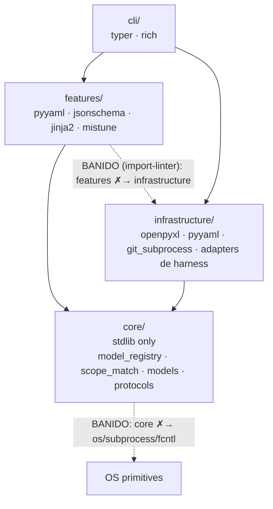

## Linguagens

Linguagem| Versão| Uso
---|---|---
Python| ^3.12| CLI inteira, features, infrastructure, container, testes pytest.
Bash| 4+ POSIX-compatível| Um único shell asset no produto: `pre-push-ci-gate.sh` (git hook, deliberadamente shell; git-for-Windows ships bash) — todos os hooks de governança são o pacote Python `dadaia_workspace/hooks/`. Python hooks inject lean payload (tech-stack.md verbatim + catalog.json, ~2.4K tokens) **uma vez por sessão** — Codex via `SessionStart`, Claude Code via first-message sentinel keyed num `SESSION_ID` estável (env ou `session_id` do stdin; sem fallback de PID). PI lê a law nativamente up-tree (sem hook de injeção de Layer 1).
HTML5 + Mermaid| Mermaid via CDN| Reports em `.dadaia/reports/<ctx>/<agent>/*.html`; memory atoms são `.md` renderizados in-memory (D-4)
Markdown| CommonMark| Memory atoms atômicos em `specs/memory/*.md` (frontmatter `memory-frontmatter-v1` + corpo Markdown); SPEC/PLAN/TASKS/CLOSURE, constitution, backlog, skill/agent definitions
YAML frontmatter| YAML 1.2| Frontmatter de agents/skills/workflows e memory atoms (`memory-frontmatter-v1`: `additionalProperties: false`)
JSON| stdlib| Estado runtime em `.dadaia/states/`, `manifest.json`; `specs/memory/product/catalog.json` (gerado a partir de frontmatter `.md`, committed, índice machine-readable de features)

## Runtimes e ferramentas

Ferramenta| Versão| Função
---|---|---
Poetry| core (build-backend)| Build, lock, virtualenv via `.venv` ou poetry-managed env
pytest| ^8| Test runner (unit/integration/e2e). Coverage gate 80%
pytest-cov| ^5| Coverage measurement
ruff| >=0.15| Linter + formatter (line-length 100, target py312)
mypy| ^1.10| Type checker
git| 2.x| VCS; `git_subprocess.py` wrapeia comandos

## Agent runtimes

  * **Claude (Anthropic)** : runtime nativo; agents projetados verbatim para `.claude/agents/` via `dadaia public install --target claude`. O `ClaudeSdkAdapter` (`infrastructure/claude_sdk_runtime.py`) dirige um worker Claude por trás de `AgentRuntimePort` num step do lifecycle; depende do extra **opcional** `claude-agent-sdk` (lazy-imported — NÃO é dependência travada; build offline-first preservado; ausência ⇒ resultado FAILED com `pip install claude-agent-sdk` acionável).
  * **Codex (OpenAI)** : parity guard ativo desde codex-agent-orchestration-parity-v1 (2026-05-20). Doctor checks D-CX-1..8 (D-CX-4 lint inclui tool-names Claude e tier-names Anthropic). 9 agentes core TOML em `.codex/agents/` com tiering registry-derived (model id × `model_reasoning_effort` via `core/model_registry.codex_tier_views()`; deep→high, dispatch→medium; collapse guard loud-fail). Zero leak `claude-*`/Opus/Sonnet/Haiku. Command policy `.codex/rules/*.rules` em `prefix_rule(...)` com paths venv-form. **Hooks executam só em sessão interativa** — `codex exec` headless não dispara hooks (codex-cli 0.139.0, live-verified; harness opt-in `tests/integration/codex_live/`, `DADAIA_CODEX_LIVE=1`). Workflows em `.codex/workflows/` (reference-only).
  * **PI (`@earendil-works/pi-coding-agent`)** : harness de entrada de Layer 1 (`{claude, codex, pi}`) **e** worker de Layer 2, selecionável por step via `--harness pi` / `--step-harness x=pi`. O `PiHeadlessAdapter` (`infrastructure/pi_runtime.py`) dirige um worker PI por trás de `AgentRuntimePort` via `pi --mode json` (subprocess, runner injetável, sem PI client em module-load). PI é um **runtime CLI externo OPCIONAL instalado pelo operador** (Node + binário `pi`), invocado como binário externo — **NUNCA** uma dependência Python/Node travada/pinned: não entra em `poetry.lock`, não é importado em build/test, e o build permanece offline-first sem ele. **No Layer 2, PI roda sob a subscrição Codex do operador → ids de modelo GPT** (LAW 2: `(gpt-5.5,high)`/`(gpt-5.5,low)`/`(gpt-5.3-codex-spark,medium)`; o adapter passa `pi --model openai-codex/<id> --thinking <effort>`). Review workers usam PI com `read,write` apenas, sem `bash`/`edit`; todos os prompts de worker proíbem invocar `dadaia lifecycle ...` de forma recursiva; prompts de review recebem o HEAD SHA exato de 40 caracteres para `metrics.commit_sha`; e o adapter recupera um handoff válido correspondente quando a mensagem final omite `artifact_refs`. O schema do event stream `pi --mode json` (especificamente a forma de `AgentMessage.content`: string vs array de content-blocks) é verificado pelos testes de integração opt-in `DADAIA_PI_LIVE=1` / `DADAIA_E2E_REAL_WORKER=1` (`tests/integration/pi_live/`, **não** CI-gated). **Build de `pi` live-verificado:** `pi` **0.79.3**, provider **openai-codex**; v0.1.31 verificou `gpt-5.5` end-to-end, v0.1.36 verificou `openai-codex/gpt-5.3-codex-spark` via smoke real de comando PI, e v0.1.37 verificou `dadaia lifecycle review security --harness pi` com handoff `APPROVED` e run persistido como `completed`. `pi` permanece um runtime CLI externo OPCIONAL (não é dependência travada). **Telemetria PI (v0.1.30):** PI persiste sessões por diretório em `~/.pi/agent/sessions/` (jsonl por dir-slug — documentado pelo consult oficial PI de 2026-05-09); `features/telemetry/reader/pi.py` ingere **só metadata** (linhas `session`/`model_change`/`thinking_level_change` — id, cwd, timestamp, modelId, provider) e **exclui a linha `message` inteira** (invariant T1 — nenhum body/conteúdo, tokens forçados a 0, `cost_micro_usd=None` nunca fakeado); degrada idle em qualquer falha de IO/parse.
  * **OpenCode** : **REMOVIDO inteiramente em v0.1.24** (ambas as layers). Não é mais um harness de entrada de Layer 1 (sem target `opencode`, sem projeção `.opencode/`) nem um worker de Layer 2 (`OPENCODE_RUN` removido do `AgentRuntimeKind`). Menções históricas vivem apenas em `_archive`/CLOSURE.
  * **Layer-2 worker harnesses (LAW 1, v0.1.24)** : as harnesses workflow selecionáveis são exatamente **`{pi, codex, fake}`**. Codex (`codex exec`) toma um modelo GPT discreto `(id, effort)` — `(gpt-5.5,high)`/`(gpt-5.5,medium)`. `CLAUDE_SDK` é mantido importável + unit-tested (uso de Layer-1) mas `claude` é rejeitado como `--harness` de workflow. **Versões CLI:** `pi` **0.79.3** (provider openai-codex, gpt-5.5) live-verificado em v0.1.31 (ver bullet PI acima); a versão verificada de `codex` ainda não foi capturada (não inventar).
  * **CLI** : agentes invocados via `claude --agent <name>` ou equivalente; modo manual sem paralelização automática.

## Model assignments (9 core agents + 3 plugin stubs)

**Tier único na prática:** os **9 agentes core** rodam em `claude-opus-4-8` — não
há tier-split em produção (verificável: os 9 frontmatter `model:` resolvem todos
para `claude-opus-4-8`). Override per-dispatch via `DADAIA_MODEL_OVERRIDE` quando a
política do dispatcher justificar. Optional packs podem definir agentes e modelos
próprios fora do default público.

**Single source:** `dadaia_workspace/core/model_registry.py` é a única fonte de
ids/pricing/tier de modelo (`ModelEntry{claude_id, codex_id, pricing dated
append-only, tier}`); `MODEL_MAP` (runtime transforms) e `PRICING_TABLE`
(telemetry) são views derivadas, com contract test de key-equality. `dadaia
public doctor` falha em `model:` frontmatter que não resolve no registry.

**Entrada reservada (não usada por nenhum agente):** o registry ainda define
`claude-fable-5` com `tier="deep"` (e o mapeamento Codex `deep→high`), mas **zero
agente core resolve para ela** — todos os 9 são `dispatch`-tier opus-4-8.
`claude-fable-5` é region-restricted; a regra do operador é **NUNCA** pinar um
agente a Fable-5. A entrada permanece como definição reservada do registry, não
como atribuição viva.

Agente| Modelo| Nota
---|---|---
project-manager| `claude-opus-4-8`| Dispatcher / lease coordinator
project-auditor| `claude-opus-4-8`| Dispatcher / audit fan-out
product-engineer| `claude-opus-4-8`| Curator / memory guardian
software-engineer| `claude-opus-4-8`| Implementation leaf (absorbs python/node/backend)
ai-engineer| `claude-opus-4-8`| AI-entity surface owner (harness-mastery synthesis workload)
software-architect| `claude-opus-4-8`| Architectural review leaf (ADDITIVE)
qa-engineer| `claude-opus-4-8`| Review → commit gate leaf
security-reviewer| `claude-opus-4-8`| Review → push gate leaf
code-reviewer| `claude-opus-4-8`| Review → PR gate leaf
frontend-engineer (plugin)| `claude-sonnet-4-6`| Plugin stub (frontend-design); no behavior without plugin
design-specialist (plugin)| `claude-sonnet-4-6`| Plugin stub (frontend-design); no behavior without plugin
devops-engineer (plugin)| `claude-sonnet-4-6`| Plugin stub (devops); no behavior without plugin

## Plugin inventory

Plugin| Status| Escopo
---|---|---
`playwright`| Retido| Universal — utilizado por `qa-engineer` (E2E) e `frontend-engineer`; optional packs podem ampliar uso.
`frontend-design`| Retido, escopo restrito| Apenas `frontend-engineer` e `design-specialist` podem invocar; outros agentes recusam com `[PLUGIN SCOPE ERROR]` per ADR-X7. Enforcement via `dadaia_workspace/public/rules/plugin-scope.md`.
`superpowers`| Removido| Uninstalled em P1; substitutos nativos via skills Tier-A.
`skill-creator`| Removido| Uninstalled em P1; autoria de skills é responsabilidade de `ai-engineer` editando diretamente `dadaia_workspace/public/skills/`.
`code-simplifier`| Removido| Uninstalled em P1; refactoring fica em `software-architect` + implementers.

## Schema handoff-v1.1

O contrato de sidecar JSON entre agentes é versionado em `dadaia_workspace/public/schemas/handoff-v1.schema.json`. A versão corrente é **v1.1** (ADR-X5). Campos obrigatórios novos: `findings[].detail_md`, `findings[].fix_recommendation`, `scope`, `metrics`. Campo `artifact.path` tornou-se opcional. `schema_version` aceita `"handoff-v1"` e `"handoff-v1.1"`. Validação via `dadaia reports validate`; lint orphan/oversized/missing-fields via `dadaia reports lint <dir>`. Default de emissão dos 9 agentes core: sidecar-only; HTML apenas sob `--with-report` ou `next_handoff.agent == "human"`.

## Dependências aprovadas

Dependência| Versão| Camada| Justificativa
---|---|---|---
typer| >=0.25 (extras=[all])| cli/| CLI framework com auto-completion e rich formatting
rich| >=13,<16| cli/| Pretty terminal output
openpyxl| ^3.1| infrastructure/| Leitura de planilhas Excel (academy)
pyyaml| ^6.0| infrastructure/ + features/| YAML frontmatter parsing (memory atoms, agents/skills/workflows); `yaml.safe_load` used by lint and catalog scripts
jsonschema| ^4| features/specs/| JSON Schema validation; now used for `memory-frontmatter-v1.schema.json` validation in `lint-memory-atoms.py`. The per-atom YAML schemas (memory-structured-source-v1) were deleted; `jsonschema` remains for frontmatter validation.
mistune| ~=3.0| features/panel/views/| Markdown → HTML render in-memory for the memory viewer (D-1, memory-markdown-source-v1). Pure-Python, zero transitive deps. Custom hooks: mermaid fence, `wikilink`, sanitiser.
types-PyYAML| >=6| dev| Type stubs para mypy
jinja2| ^3.1| features/specs/| Dependência **direta** de runtime: `features/specs/scaffolder.py` renderiza os templates de scaffold SDD via `SandboxedEnvironment`. NÃO é usada para memory rendering (memory atoms são `.md` renderizados por mistune).
import-linter| latest| dev| Architecture contract enforcement; `setup.cfg` declares `features → infrastructure` import ban and `core → OS-primitive modules` ban; runs in local `dadaia ci preflight` and CI `lint` job via `lint-imports`. Zero runtime impact.

**Pins de tooling do workspace (não são deps do projeto):** `poetry` ≥ 2.3.4 e
`dulwich` ≥ 1.2.5 nos ambientes de operação (CVEs nomeados em comentário no
`pyproject.toml`); não entram em `poetry.lock` — o build-backend é `poetry-core`.

Onde cada dependência vive, e os bans de import que o `import-linter` enforça em
CI (camadas hexagonais — seta = direção de import permitida):

`features/` fala com o mundo externo apenas por `core/protocols/*`, implementados em
`infrastructure/` e injetados no `container.py` (hexagonal port/adapter). `core/` é
puro: zero I/O, zero OS primitive — por isso é testável e cross-platform.

## Restrições e proibições

  * NÃO adicionar dependências fora desta lista sem release aprovada que justifique.
  * NÃO usar libs com network em build/test (offline-first).
  * `claude-agent-sdk` é um **runtime extra OPCIONAL instalado pelo operador**, NÃO uma dependência travada/pinned: não entra em `poetry.lock`, não é importado em module-load, e é lazy-imported apenas pelo `ClaudeSdkAdapter` quando o operador escolhe rodar um step no harness Claude SDK. O build e os testes permanecem offline-first sem ele.
  * `pi` / `@earendil-works/pi-coding-agent` é um **runtime CLI externo OPCIONAL instalado pelo operador** (Node + o binário `pi`; autentica via a **subscrição Codex do operador** em `~/.pi/agent/auth.json` — provider `openai-codex`/GPT, **NÃO** `ANTHROPIC_API_KEY`), invocado como binário externo pelo `PiHeadlessAdapter` via subprocess — **NÃO** uma dependência Python/Node travada/pinned: não entra em `poetry.lock`, não é importado em module-load, e os testes são totalmente faked (offline-first preservado). A versão de `pi` live-verificada é **0.79.3** (provider openai-codex, gpt-5.5), confirmada em v0.1.31 pelo live seam (`DADAIA_E2E_REAL_WORKER=1`).
  * NÃO usar threading/multiprocessing nas features — orquestração concorrente fica em `features/orchestration/`.
  * NÃO chamar `os.system`/`subprocess` fora de `infrastructure/` — features usam protocols.
  * NÃO importar Python <3.12 backports — runtime mínimo é 3.12 (match/case, generic types nativos, type statement).
  * NÃO escrever em `.claude/`, `.codex/`, `.pi/`, `.agents/` diretamente — apenas via `dadaia public install` a partir de `public/`. (`.opencode/` não existe mais — OpenCode removido em v0.1.24.)

## Comandos canônicos

Como rodar, testar, lintar e empacotar:

    # Setup
    poetry install

    # Run CLI (dev)
    poetry run dadaia <subcommand>
    # ou globalmente após install
    dadaia <subcommand>

    # Tests
    pytest                                  # default behavior suite; performance deselected
    pytest tests/integration/cli/           # CLI/integration behavior slice
    pytest -k test_clean_tree               # by name

    # Lint + format
    ruff check .
    ruff format .

    # Type check
    mypy dadaia_workspace

    # Asset chain
    dadaia public stage
    dadaia public install --target all      # --force para sobrescrever drift
    dadaia public doctor

    # SDD
    dadaia specs doctor                     # estrutura SDD
    dadaia specs doctor --json              # machine-readable

    # Backlog-consistency engine (features/backlog/, v0.1.25)
    dadaia backlog subjects                 # lista o anchor set canônico vivo (opcional --kind / --resolve "<ref>")
    dadaia backlog doctor                   # BL-SCHEMA/DUP/CONFLICT/STALE; exit !=0 em violação (wired no pre-commit + CI)
    dadaia backlog doctor --explain         # mostra como um subject proposto resolve (anchor | UNRESOLVED | AMBIGUOUS)

    # backlog_definition dadaia-workflow (features/lifecycle/workflows/backlog_definition.py, v0.1.26)
    dadaia lifecycle backlog define --harness {pi|codex|fake} --model <id>   # workflow §4 ORIENTED; gates Python-owned; LAW 1/LAW 2 (claude rejeitado)
