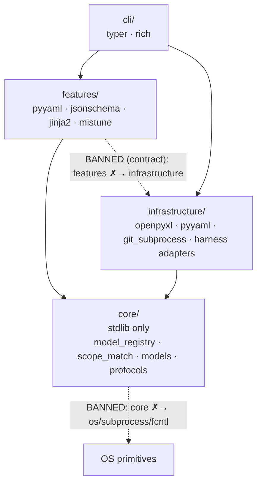

## Languages

Language| Version| Use
---|---|---
Python| ^3.12| Entire CLI, features, infrastructure, container, pytest tests.
Bash| 4+ POSIX-compatible| Shell assets in the product: only the git chokepoints `pre-commit-lease-gate.sh` + `pre-push-ci-gate.sh` (git hooks, deliberately shell; git-for-Windows ships bash) — all harness governance hooks are the Python package `dadaia_workspace/hooks/` (context-injection mechanics: [[context-management]]).
HTML5 + Mermaid| `mermaid` fences in Markdown| Reports in `.dadaia/reports/<ctx>/<agent>/*.html`; memory atoms are `.md` rendered in-memory. The panel does NOT load Mermaid from a CDN (CSP `script-src 'self'`): fences become `<pre class="mermaid">` displayed as source
Markdown| CommonMark| Atomic memory atoms in `specs/memory/*.md` (frontmatter `memory-frontmatter-v1` + Markdown body); SPEC/PLAN/TASKS/CLOSURE, constitution, backlog, skill/agent definitions
YAML frontmatter| YAML 1.2| Frontmatter of agents/skills/workflows and memory atoms (`memory-frontmatter-v1`: `additionalProperties: false`)
JSON| stdlib| Runtime state in `.dadaia/states/`, `manifest.json`; `specs/memory/product/catalog.json` (generated from `.md` frontmatter, committed, machine-readable feature index)

## Runtimes and tools

Tool| Version| Role
---|---|---
Poetry| core (build-backend)| Build, lock, virtualenv via `.venv` or poetry-managed env
pytest| >=8,<10| Test runner — test taxonomy and gates owned by [[quality-assurance]]
pytest-cov| >=5,<8| Coverage measurement
ruff| >=0.15| Linter + formatter (line-length 100, target py312)
mypy| >=1.10,<3.0| Type checker
git| 2.x| VCS; `git_subprocess.py` wraps commands

## Agent runtimes

**This section is the ONLY source of the harness/runtime roster** (constitution §0,
roster invariant; SPEC-DOC-037 prevents the constitution from enumerating it). This section
stays the roster *doc* single source; its typed *code* embodiment is
`core/harness_registry.py` (v0.1.58 — `L1_ENTRY_HARNESSES`/`L2_WORKER_HARNESSES` + capability
predicates + the install-target vocabulary), locked to `harness_models.harnesses()` by a
contract test so the doc roster and the code registry never fork. The roster:

  * **Layer 1 — entry harnesses (what the operator launches in the terminal):** exactly **`{claude, codex, pi}`**.
  * **Layer 2 — workflow worker harnesses (selectable in `dadaia lifecycle`):** exactly **`{pi, codex}`** (+ **`fake`** test-only). `claude` is rejected as a workflow `--harness` — **Claude Code is Layer-1-only by law** (cost bound).
  * **`AgentRuntimeKind` (`core/models/lifecycle.py`) — 4 members:** `FAKE`, `CODEX_EXEC`, `CLAUDE_SDK`, `PI_HEADLESS`. `CLAUDE_SDK` is kept importable + unit-tested but is **not selectable** as a workflow harness.

Per harness (per-runtime truth in `specs/memory/product/harness/` — [[harness-claude-code]], [[harness-codex]], [[harness-pi]]):

  * **Claude (Anthropic)**: native Layer-1 runtime; agents projected verbatim to `.claude/agents/` via `dadaia public install --target claude`. The `ClaudeSdkAdapter` (`infrastructure/claude_sdk_runtime.py`) remains behind `AgentRuntimePort`; it depends on the **optional** `claude-agent-sdk` extra (optional extra `claude-sdk` in `pyproject.toml`/`poetry.lock` — lazy-imported, not a base dependency, never installed by default; offline-first build preserved; absence ⇒ FAILED result with an actionable `pip install claude-agent-sdk`).
  * **Codex (OpenAI)**: Layer 1 (TUI) and Layer 2 (`CODEX_EXEC` via `codex exec`). Doctor checks D-CX-1..8. 12 TOML agents in `.codex/agents/` (9 core + 3 plugin stubs) with registry-derived tiering — tier-view mechanics, the D-CX-4 lint, and the live-verification harness are owned by [[harness-codex]]. Zero `claude-*`/Opus/Sonnet/Haiku leaks. Command policy `.codex/rules/*.rules` in `prefix_rule(...)` with venv-form paths. **Hooks run only in interactive sessions** — headless `codex exec` fires no hooks ([[harness-codex]]). Workflows in `.codex/workflows/` (reference-only). Layer-2 models: `(gpt-5.5,high)` / `(gpt-5.5,medium)`.
  * **PI (`@earendil-works/pi-coding-agent`)**: Layer 1 (entry harness) **and** Layer 2 (`PI_HEADLESS`), selectable per step via `--harness pi` / `--step-harness x=pi`. The `PiHeadlessAdapter` (`infrastructure/pi_runtime.py`) drives a PI worker via `pi --mode json` (subprocess, injectable runner, no PI client at module load). PI is an **OPTIONAL external CLI runtime installed by the operator**, invoked as an external binary — **NEVER** a locked/pinned dependency: it is not a Python dependency at all (absent from the lockfile), it is not imported in build/test, and the build stays offline-first without it. **Auth: PI runs under the operator's Codex subscription via `~/.pi/agent/auth.json`** (provider openai-codex) — no Anthropic key is required. **Layer-2 models (4):** `(gpt-5.5,high)` / `(gpt-5.5,low)` / `(gpt-5.3-codex,medium)` / **`kimi-2.7:high`** — the curated OpenRouter id via `LAYER2_EXTRA_MODEL_IDS` (`core/harness_models.py`), selectable through the built-in profile `pi-openrouter-kimi-high`; `kimi-*` ids have no pricing row in the registry (cost `None`, never fabricated). The `pi --mode json` event-stream schema is verified by the opt-in tests `DADAIA_PI_LIVE=1` / `DADAIA_E2E_REAL_WORKER=1` (`tests/integration/pi_live/`, **not** CI-gated). Live-verified build: `pi` **0.79.3**. **PI telemetry:** `features/telemetry/reader/pi.py` ingests **metadata only** from `~/.pi/agent/sessions/` (invariant T1 — no body/content; cost never faked); degrades idle on IO/parse failure.
  * **CLI versions:** `pi` 0.79.3 live-verified; the verified `codex` version has not been captured yet (do not invent).
  * **Workflow `--harness` default = `auto` (v0.1.64):** every `dadaia lifecycle` run verb defaults `--harness` to the sentinel `auto`, resolved by `core/session_env.entry_harness()` — `DADAIA_ENTRY_HARNESS` ∈ {codex, pi} (the operator/PI-seam pin) > `CODEX_SESSION_ID` present ⇒ `codex` > `fake` (Claude entry — Layer-1-only — and plain shells/CI). An explicit `--harness` always wins; every real-worker auto-default prints one loud `[harness] auto-default: <name> (from entry session; pass --harness to override)` line on stderr (resolving `fake` prints nothing). The pytest lifecycle envelope and the GHA quality jobs are asserted free of the three entry-signal vars, so no defaulted test or CI step can spawn a real worker.

## Model assignments (9 core agents + 3 plugin agents)

**Two independent axes, disambiguated at source (v0.1.64).** A frontmatter carries a numeric
`dispatch_band: 1/2/3` (the Layer-1 **dispatch band**: 1 dispatchers, 2 curator, 3 leaf
workers — renamed from the legacy `tier:` key, which the reader still tolerates silently
during the strip window tracked by `dispatch-band-legacy-fallback-removal`) AND a `model:`
that resolves to a registry **`Tier`** (`deep`/`dispatch`/`fast`/`plugin`, the **model-cost
class** — this axis keeps the name `Tier`). The mandatory
`tests/contract/test_agent_tier_taxonomy.py` machine-enforces both (every non-plugin core agent
carries a numeric `dispatch_band` + a registry-known `model`).

**Core agent (model, effort) is policy-governed, not hardcoded (v0.1.65).** The 9 core
`public/agents/*.md` bodies are **model-agnostic** — they carry no `model:`/`effort:`
frontmatter. The concrete `(model, effort)` pair is **composed at install time** from a policy
and rendered as the last two frontmatter lines of the projected `.claude/agents/<name>.md`
(and fed to the codex projection). The policy has three parts (mirrors the Layer-2 workflow
model-governance stack — [[agent-orchestration]] "Layer-1 agent model governance"): a
library-shipped registry of **3 built-in templates** (`balanced` DEFAULT, `subscription-saver`,
`max-quality` — `core/agent_model_templates.py`), an operator **overlay**
(`.dadaia/states/agent_model_policy.json`, schema `agent-model-policy-v1`,
`{applied_template, overrides}`), and a **single resolver** `resolve_agent_model` whose
per-field precedence is **per-agent override > applied template > `balanced`**. The operator
retiers agents live from the panel **Sub-agents** tab ([[panel]]). Claude effort vocabulary is
`low|medium|high|xhigh|max` (officially-supported first-class agent frontmatter); the Codex
`model_reasoning_effort` is derived from the **resolved per-agent effort** via the fixed D-3
clamp `low→low, medium→medium, high→high, xhigh→high, max→high` (no longer tier-only).
Per-dispatch override via `DADAIA_MODEL_OVERRIDE` still applies.

**`balanced` — the no-overlay default (live on this instance, v0.1.65 D-1 retier).** With no
overlay, install renders the `balanced` roster, which **supersedes the 2026-07-06 hardcoded
5-Fable retier**: `claude-fable-5` (registry `Tier` = `deep`; Codex `gpt-5.5`) now runs on
**only `project-manager` + `software-architect`**; `claude-opus-4-8` (`Tier` = `dispatch`;
Codex `gpt-5.5`) on `product-engineer`/`project-auditor`/`security-reviewer`/`code-reviewer`;
`claude-sonnet-5` (`Tier` = `plugin`; Codex `gpt-5.3-codex`) on
`ai-engineer`/`software-engineer`/`qa-engineer`. **Hard constraint (D-7):
`claude-fable-5` is NEVER assigned to `security-reviewer`** — its cyber-safety classifiers can
refuse security-review-shaped work — enforced at three layers (template import-time assert,
overlay store/parse validation, panel validate endpoint). The `subscription-saver` template
runs zero Fable (opus on the three strategic roles, sonnet-5 elsewhere); `max-quality` widens
Fable/opus. Full per-template rosters are pinned verbatim by
`tests/contract/test_agent_tier_taxonomy.py`.

**Plugin agents: off-opus by design (v0.1.60; sonnet-5 since v0.1.65).** When a pack installs
([[plugin-packs]]), the 3 plugin agents carry `model: claude-sonnet-5` (registry `Tier` =
`plugin`; Codex renders `gpt-5.3-codex`, NOT the opus `gpt-5.5`) as the pack-provided default,
with the same per-agent override capability layered on top when the pack is installed. The
`fast`/haiku tier remains **registry-defined but unassigned by design** — it prices historical
haiku telemetry events (the `fast-tier-persona-validation` item was dispositioned REJECTED,
premise-dead post-retier, at v0.1.64; a revival must carry the recorded operator-live
equal-quality checkpoint AC — archived v0.1.64 SPEC §8).

**Efficiency-audit staleness trigger (v0.1.60).** A `dadaia doctor` `DoctorIssue(code="EFF-1")`
fires when `.dadaia/states/last_efficiency_audit.json`
(`{schema_version,last_efficiency_audit,by,report}`) is older than the named constant
`EFFICIENCY_AUDIT_STALE_DAYS = 30` (or malformed); absent ⇒ no issue (fresh-workspace happy
path preserved). The marker is written — and the issue cleared — by
`dadaia reports mark-efficiency-audit --report <path> [--by <agent>]`; the bare `dadaia doctor`
exit stays 0.

**Single source:** `dadaia_workspace/core/model_registry.py` is the only source of
model ids/pricing/tier (`ModelEntry{claude_id, codex_id, pricing dated
append-only, tier}`); `MODEL_MAP` (runtime transforms) and `PRICING_TABLE`
(telemetry) are derived views, with a key-equality contract test. `dadaia
public doctor` fails on a resolved `model:` that does not resolve in the registry.
`claude-sonnet-5` was added in v0.1.65 (`codex_id="gpt-5.3-codex"`, `Tier="plugin"`,
pricing `(3.00, 15.00, 3.75, 0.30)` effective 2026-07-01). **F-4 note:** sonnet-5's
`plugin` `Tier` is a **forced cost-axis label, decoupled from dispatch-band and agent
behavior** — sonnet-5 shares sonnet-4-6's cost class and any other tier would violate the
`_codex_id_for_tier`/`codex_tier_views` invariants; core-agent codex effort now comes from the
D-3 clamp of the resolved policy effort, not from `codex_effort_for_tier`, so the `plugin`
label no longer drives core-agent effort. The `plugin` tier-NAME mismatch is a tracked backlog
return, out of scope this release.

**Resolved roster under the no-overlay `balanced` default (this instance, v0.1.65).** The
`(model, effort)` pair below is *rendered into the projection*, not authored in the source
body; an operator overlay re-tiers any row live.

Agent| Model (effort)| Note
---|---|---
project-manager| `claude-fable-5` (`effort: high`)| Dispatcher / lease coordinator
software-architect| `claude-fable-5` (`effort: high`)| Architectural review leaf (ADDITIVE)
product-engineer| `claude-opus-4-8` (`effort: high`)| Curator / memory guardian
project-auditor| `claude-opus-4-8` (`effort: xhigh`)| Dispatcher / audit fan-out
security-reviewer| `claude-opus-4-8` (`effort: xhigh`)| Review → push gate leaf; **NEVER `claude-fable-5`** (D-7)
code-reviewer| `claude-opus-4-8` (`effort: high`)| Review → PR gate leaf
ai-engineer| `claude-sonnet-5` (`effort: high`)| AI-entity surface owner (harness-mastery synthesis workload)
software-engineer| `claude-sonnet-5` (`effort: xhigh`)| Implementation leaf (absorbs python/node/backend)
qa-engineer| `claude-sonnet-5` (`effort: high`)| Review → commit gate leaf
frontend-engineer (plugin)| `claude-sonnet-5` (when installed)| Plugin agent (frontend-design pack); registry `plugin` tier / Codex `gpt-5.3-codex`; core stub carries no `model:` until `dadaia plugin install frontend-design`
design-specialist (plugin)| `claude-sonnet-5` (when installed)| Plugin agent (frontend-design pack); registry `plugin` tier / Codex `gpt-5.3-codex`; core stub carries no `model:` until the pack installs
devops-engineer (plugin)| `claude-sonnet-5` (when installed)| Plugin agent (devops pack); registry `plugin` tier / Codex `gpt-5.3-codex`; core stub carries no `model:` until `dadaia plugin install devops`

## Plugin inventory

Plugin| Status| Scope
---|---|---
`playwright`| Retained| Universal — used by `qa-engineer` (E2E) and `frontend-engineer`; optional packs may widen usage.
`frontend-design`| Installable (in-package since v0.1.60)| Plugin pack for `frontend-engineer` + `design-specialist` (+ 4 skills: `browser-frontend-implementation`, `design-system-authoring`, `frontend-component-architecture`, `visual-review-protocol`). Distributed in-package under `public/plugins/`; enabled per workspace with `dadaia plugin install frontend-design`, disabled with `dadaia plugin uninstall` (ledger `.dadaia/states/installed_plugins.json` — [[plugin-packs]]). Until installed in a given workspace, core agents handed a plugin-domain task respond `[PLUGIN REQUIRED]` and route to the operator, per `dadaia_workspace/public/rules/plugin-scope.md`.
`devops`| Installable (in-package since v0.1.60)| Plugin pack for `devops-engineer` (CI/CD, GitHub Actions, gitflow, deploy; + 4 skills: `github-actions-cicd`, `gitflow-release-engineering`, `container-build-and-deploy`, `cicd-security-hardening`). Enabled per workspace with `dadaia plugin install devops` (uninstall symmetric); same install-gated routing as `frontend-design` ([[plugin-packs]]).
`superpowers`| Removed| Uninstalled in P1; native replacements via Tier-A skills.
`skill-creator`| Removed| Uninstalled in P1; skill authoring is `ai-engineer`'s responsibility, editing `dadaia_workspace/public/skills/` directly.
`code-simplifier`| Removed| Uninstalled in P1; refactoring stays with `software-architect` + implementers.

## Schema handoff-v1 family

The JSON sidecar contract between agents is versioned in
`dadaia_workspace/public/schemas/handoff-v1.schema.json`; current token **v1.2**
(the `self_pull.refs` audit line; v1/v1.1 documents stay valid forever).
Field-level contract, validation CLI, and emission defaults: [[agent-comms]].

## Approved dependencies

Dependency| Version| Layer| Justification
---|---|---|---
typer| >=0.25 (extras=[all])| cli/| CLI framework with auto-completion and rich formatting
rich| >=13,<16| cli/| Pretty terminal output
openpyxl| ^3.1| infrastructure/| Excel spreadsheet reading (academy)
pyyaml| ^6.0| infrastructure/ + features/| YAML frontmatter parsing (memory atoms, agents/skills/workflows); `yaml.safe_load` used by lint and catalog scripts
jsonschema| ^4| features/specs/| JSON Schema validation; now used for `memory-frontmatter-v1.schema.json` validation in `lint-memory-atoms.py`. The per-atom YAML schemas (memory-structured-source-v1) were deleted; `jsonschema` remains for frontmatter validation.
mistune| >=3.0,<4.0| features/panel/views/| Markdown → HTML render in-memory for the memory viewer (D-1, memory-markdown-source-v1). Pure-Python, zero transitive deps. Custom hooks: mermaid fence, `wikilink`, sanitiser.
types-PyYAML| >=6| dev| Type stubs for mypy
pytest-randomly| ^4.1.0| dev| Random test order per run — flushes inter-test order dependencies
hypothesis| >=6.100| dev| Property-based testing (database redirected outside the repo — repo-hygiene)
jinja2| ^3.1| features/specs/| **Direct** runtime dependency: `features/specs/scaffolder.py` renders the SDD scaffold templates via `SandboxedEnvironment`. NOT used for memory rendering (memory atoms are `.md` rendered by mistune).
import-linter| >=2.11| dev| Layer contracts in `setup.cfg` — full enforcement-status statement single-sourced in [[architecture]] §Enforcement.

**Workspace tooling pins (not project deps):** `poetry` ≥ 2.3.4 and
`dulwich` ≥ 1.2.5 in the operating environments (CVEs named in a comment in
`pyproject.toml`); they do not enter `poetry.lock` — the build-backend is `poetry-core`.

Where each dependency lives, and the import bans the `import-linter` contracts
describe (hexagonal layers — arrow = allowed import direction; enforcement
status: [[architecture]]):

`features/` talks to the external world only through `core/protocols/*`, implemented in
`infrastructure/` and injected in `container.py` (hexagonal port/adapter). `core/` is
pure: zero I/O, zero OS primitives — which is why it is testable and cross-platform.

## Restrictions and prohibitions

  * DO NOT add dependencies outside this list without an approved release justifying it.
  * DO NOT use libs with network access in build/test (offline-first).
  * `claude-agent-sdk` is an **optional extra** (`claude-sdk`, `pyproject.toml`), NOT a base dependency: it appears in `poetry.lock` as `optional = true`, is never installed by default, is not imported at module-load, and is lazy-imported only by the `ClaudeSdkAdapter` when the operator chooses to run a step on the Claude SDK harness. Build and tests stay offline-first without it.
  * `pi` is an optional external CLI runtime installed by the operator — never a locked Python dependency. Runtime/auth facts stated once in `#Agent runtimes`.
  * DO NOT use threading/multiprocessing in features — any process-level concurrency runs through the lifecycle engine's bounded worker subprocesses (injected `ProcessRunner`), never spawned inside a feature.
  * DO NOT call `os.system`/`subprocess` outside `infrastructure/` — features use protocols.
  * DO NOT import Python <3.12 backports — minimum runtime is 3.12 (match/case, native generic types, type statement).
  * DO NOT write into `.claude/`, `.codex/`, `.pi/`, `.agents/` directly — only via `dadaia public install` from `public/`.

## Canonical commands

How to run, test, lint, and package:

    # Setup
    poetry install

    # Run CLI (dev)
    poetry run dadaia <subcommand>
    # or globally after install
    dadaia <subcommand>

    # Tests
    pytest                                  # all
    pytest tests/unit/features/specs/       # specs doctor unit tests
    pytest -k test_clean_tree               # by name

    # Lint + format
    ruff check .
    ruff format .

    # Type check
    mypy dadaia_workspace

    # Asset chain
    dadaia public stage
    dadaia public install --target all      # plain install propagates updates (overwrites on hash mismatch); --force only to clobber a hand-edited (locally-diverged) projection
    dadaia public doctor

    # SDD
    dadaia specs doctor                     # SDD structure
    dadaia specs doctor --json              # machine-readable

    # Backlog-consistency engine (features/backlog/, v0.1.25)
    dadaia backlog subjects                 # lists the live canonical anchor set (optional --kind / --resolve "<ref>")
    dadaia backlog doctor                   # BL-SCHEMA/DUP/CONFLICT/STALE; exit !=0 on violation (wired into pre-commit + CI)
    dadaia backlog doctor --explain         # shows how a proposed subject resolves (anchor | UNRESOLVED | AMBIGUOUS)

    # backlog_definition dadaia-workflow (features/lifecycle/workflows/backlog_definition.py, v0.1.26)
    dadaia lifecycle backlog define [--harness {auto|pi|codex|fake}] [--step-model <step>=<profile-id>]   # Python-owned gates; LAW 1/LAW 2 (claude rejected); --harness defaults to auto (entry-session resolution, v0.1.64)
