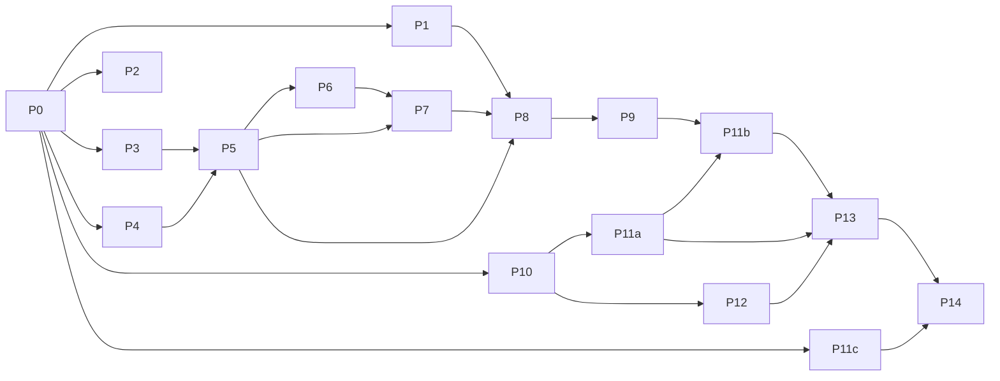

# Plan: Release — agents-r2-v1

> **Status:** Aprovado
> **Status note:** pending operator review.
> **Release ID:** agents-r2-v1
> **Owner:** product-engineer
> **Created:** 2026-05-18
> **Phase:** PLAN
> **SPEC:** `specs/releases/agents-r2-v1/SPEC.md` (Aprovado; FR7.11 amended for Option C).
> **Architect ADR:** `.dadaia/reports/dadaia-workspace/software-architect/2026-05-19T003956Z-adr-claude-agents-parity.html` — chose **Option C**.

## 1. Sumário

Fifteen phases (P0–P14) implement the seven-FR SPEC delta.
Subtractive + consolidative + enforcement-flip; no new agents, skills,
workflows. Net new code: one installer fn
(`_install_workspace_guardrail_pair`), one gate check (path-scope), one
script (skill orphan), one coordinated operator-side migration (FR10).
Every phase touching lib-projected content closes with stage + install
+ doctor green.

## 2. Arquitetura

### 2.1 Surfaces touched

| Surface | Change |
|---|---|
| `public/scripts/sdd-spec-gate.sh` | New path-scope check after TASKS-marker check |
| `infrastructure/public_assets.py` | New `_install_workspace_guardrail_pair` fans single `data/AGENTS.md` → 2 filenames × N targets |
| `public/data/AGENTS.md` | 365 → ≤ 280 lines, lib-general scope only |
| `public/workflows/` | 15 → 7 (8 `git mv` to `_archive/legacy-workflows/`) |
| `public/rules/` | 6 → 2 (4 `git mv` to `_archive/legacy-rules/`) |
| 16 `public/agents/*.md` | all gain `paths:` block; PE + s-architect lose Bash; PM/auditor/design gain `## Scope and forbidden actions` body section; devops + PM + FE gain orphan skills |

### 2.2 Option C — single-source dual-name projection

Single source `dadaia_workspace/public/data/AGENTS.md`; `data/CLAUDE.md`
**does NOT exist** as a source. `dadaia public install` fans the source
to two filenames at each target:

```
<workspace-root>/AGENTS.md       + /CLAUDE.md                  (2 files)
<workspace-root>/repos/<slug>/AGENTS.md + /CLAUDE.md            (2 files per <slug> with .dadaia/ marker)
```

Doctor emits 4 `[ok|fail]` parity lines per source, all comparing to the
same source SHA-256:

```
[ok]   root:AGENTS.md            → <workspace>/AGENTS.md
[ok]   root:CLAUDE.md            → <workspace>/CLAUDE.md
[ok]   repos/<slug>:AGENTS.md    → <workspace>/repos/<slug>/AGENTS.md
[ok]   repos/<slug>:CLAUDE.md    → <workspace>/repos/<slug>/CLAUDE.md
```

**Consumer-repo discovery (ADR item 2):** `<repo>/.dadaia/` AND
`<repo>/.dadaia/agentic/` must both exist as directories. Today's
marker-bearing repos: `redacted-slug`, `redacted-slug`, `workflow-tools`
(`dadaia-workspace` self-skipped — R14).

**Idempotent skip (ADR item 4):** absent or marker-less consumer →
`[skip] <path> (no .dadaia/ marker)`; never errors.

**Nested-pair non-interference (ADR item 5):** `services/CLAUDE.md` /
`services/AGENTS.md` (FR10, operator-authored) MUST NOT be touched by
install and MUST NOT appear in any parity check. P7 + P9 fixtures verify.

**Out-of-scope (ADR items 6–7):** `--repos-only` / `--workspace-only`
flags → `backlog/candidates.md`; per-projection opt-out marker →
`backlog/ideas.md`.

## 3. Fases (P0–P14)

Format: **PN — title** *owner.* Deliverables / Acceptance / Deps / Parallel.

**P0 — Foundation.** *PE.* Branch cut; ACTIVE.md set; SPEC Aprovado;
ADR consumed. *Acc:* artifacts on disk. *Deps:* none.

**P1 — Workflow trim 15 → 7.** *software-engineer.* `git mv` 8 workflows
(`game-spec-definition`, `architecture-review`, `tdd-cycle`,
`bug-fix-fastlane`, `game-bugfix`, `security-patch`,
`deploy-validation-only`, `design-validation`) to
`specs/_archive/legacy-workflows/<UTC>/`. Stage + install + doctor green
(cleanup-on-absence). *Acc:* C1 + C2 + NFR1. *Deps:* P0. *Parallel:* P2, P3, P4.

**P2 — PM Playbooks in `project-orchestration` skill.** *PE drafts →
software-engineer wraps.* `SKILL.md` gains `## PM Playbooks` after
inventory: 8 playbooks ≤ 20 lines each. `game-spec-definition` becomes
a `scope=game` sub-entry of the `spec-refinement` playbook. *Acc:* C3
(`grep -c '^### Playbook' SKILL.md` → 8). *Deps:* P0. *Parallel:* P1, P3, P4.

**P3 — `paths:` block on 16 agents.** *software-engineer.* Mechanical
per SPEC FR2.1 table; reader unchanged from r1. *Acc:* C4. *Deps:* P0.
*Parallel:* P1, P2, P4.

**P4 — Architect consult: path-scope gate pattern.** *software-architect.*
Report at `.dadaia/reports/dadaia-workspace/software-architect/<UTC>-path-scope-gate-pattern.html`
proposes runtime agent-detection mechanism (env var / PreToolUse payload
field / fallback per harness) + cache strategy. *Acc:* report + handoff
sidecar emitted. *Deps:* P0. *Parallel:* P1, P2, P3.

**P5 — Path-scope check in `sdd-spec-gate.sh`.** *software-engineer
(pattern from P4).* After TASKS-marker check, mismatch returns
`{"decision":"block","reason":"[PATH SCOPE ERROR] agent <X> cannot write to <path>. write_allowlist: <list>."}`;
fail-open with `/tmp/sdd-gate.log` warning if no agent persona (NFR3).
New `tests/unit/gate/test_path_scope.py` covers accept / reject /
fail-open. *Acc:* C5. *Deps:* P3, P4.

**P6 — Remove Bash from PE + software-architect.** *software-engineer.*
PE's `tools:` loses `Bash`; body delegates `dadaia specs doctor`,
`dadaia context show`, `cat ACTIVE.md` to PM. software-architect's
`tools:` loses `Bash`; body audited for Bash invocations (R7 — none
expected). *Acc:* C6 + C7. *Deps:* P5. *Parallel:* P7.

**P7 — Test updates.** *software-engineer + qa-engineer.* Workflow
fixture → 7. Agent fixture stays 16. Path-scope test from P5. New
`tests/unit/features/public/test_workspace_guardrail_pair.py` placeholder
(real assertions in P9): 4-target projection; idempotent skip; nested-pair
non-interference. *Acc:* C9 intermediate. *Deps:* P5, P6.

**P8 — Stage + install + doctor #1.** *devops-engineer.* Stage + install
+ doctor green for leaner config (post-P1 trim, pre-P11 rewrite). Stale
workflow projections deleted (R4). Consumer-repo sweep #1 green. *Acc:*
C11 + C12 intermediate. *Deps:* P1, P3, P5, P6, P7.

**P9 — Build `_install_workspace_guardrail_pair`.** *software-engineer.*
In `dadaia_workspace/infrastructure/public_assets.py` add
`_install_workspace_guardrail_pair(agentic_dir, workspace_root, force, installed)`:
reads single source `data/AGENTS.md`; enumerates `(workspace_root/"repos").iterdir()`
filtered by `(p/".dadaia").is_dir() and (p/".dadaia"/"agentic").is_dir()`
(R13); self-skip via `package_version` match in
`<repo>/.dadaia/agentic/manifest.json` (R14); writes 4 files per round
(workspace root × 2 + each consumer × 2) via existing `_copy_file`;
marker-less consumers → `[skip] <path> (no .dadaia/ marker)`, never raises.
`_runtime_expectations` yields 4 tuples per call (labels `root:AGENTS.md`,
`root:CLAUDE.md`, `repos/<slug>:AGENTS.md`, `repos/<slug>:CLAUDE.md`).
Legacy `_install_agents_md` + `_agents_md_source` REMAIN for the
`templates/AGENTS.md` scaffolder. *Acc:* test_workspace_guardrail_pair.py
covers 6 cases (4-target write; 3 skip variants; nested-pair byte-equal;
doctor 4 lines). *Deps:* P8. *Parallel:* P10.

**P10 — FR6: inline scope rules; archive 4 rule files.**
*software-engineer.* `project-manager.md`, `project-auditor.md`,
`design-specialist.md` each gain `## Scope and forbidden actions` section
copied verbatim from the corresponding `*-scope.md`.
`dadaia-workspace-dev-guardrail.md` content moves into P11a rewrite. 4
rule files `git mv` to `specs/_archive/legacy-rules/<UTC>/`.
`ls public/rules/ | wc -l` → 2. *Acc:* C14 + C15. *Deps:* P0. *Parallel:* P9.

**P11a — Rewrite `data/AGENTS.md` (single source, lib-general only).**
*PE.* Rewrite to ≤ 280 lines per SPEC FR7.9 11-section structure.
Pre-commit forbidden-strings grep (SPEC FR7.2) exits 1. PE asserts
`! test -e dadaia_workspace/public/data/CLAUDE.md` (Option C invariant).
*Acc:* C16, C17, C18, C19, C21, C22, C23. *Deps:* P10. *Parallel:* P11c, P12.

**P11b — Wire installer + doctor for Option C.** *software-engineer.*
Install dispatcher calls `_install_workspace_guardrail_pair` once per
workspace (replaces legacy `_install_agents_md` call site for
`data/AGENTS.md` only). `.dadaia/agentic/manifest.json` `data/AGENTS.md`
entry SHA updated post-P11a; no `data/CLAUDE.md` entry. *Acc:* C24 +
C25; `grep -c '"data/CLAUDE.md"' manifest.json` → 0. *Deps:* P9, P11a.

**P11c — Author FR10 operator manual-migration checklist.** *PE.*
`CLOSURE.md` stub created with `## Operator manual migration (FR10)`
containing literal commands: (1) capture pre-r2 workspace-root `CLAUDE.md`;
(2) author `services/CLAUDE.md` (redacted-infra/redacted-infra/Traefik sections);
(3) mirror to `services/AGENTS.md`, verify sha256 match; (4) run
`dadaia public stage && install --target all && doctor`; (5) verify post:
workspace-root pair sha256-match; forbidden-strings grep on root
`CLAUDE.md` exits 1; same grep on `services/CLAUDE.md` exits 0. PR
description (P13) links to this CLOSURE section. *Acc:* C26 deferred to
CLOSURE. *Deps:* P0. *Parallel:* P11a, P12.

> See `CLOSURE.md` §"Operator manual migration (FR10)" for the literal
> command sequence drafted under P11c (5 numbered groups).

**P12 — FR8: skill orphan wiring + verification script.**
*software-engineer + qa-engineer.* `devops-engineer.md` + `project-manager.md`
`skills:` gain `dadaia-workspace-doctor`; `frontend-engineer.md` `skills:`
gains `dev-server-registry`. New `tests/scripts/check_skill_orphans.py`
(≤ 50 lines) asserts every skill is referenced by ≥ 1 agent. Self-test
in `tests/unit/scripts/test_check_skill_orphans.py` (R11): seed fake-orphan
and fake-wired skills, assert detector. CI runs script from pytest.
*Acc:* C20. *Deps:* P10. *Parallel:* P11a, P11c.

**P13 — Stage + install + doctor #2.** *devops-engineer.* Stage + install
+ doctor against final state. Stale rule projections deleted (R12).
Doctor emits 4 parity lines per source, all `[ok]`. Consumer-repo sweep
#2 green. `sha256sum` cross-check: all projected `{AGENTS,CLAUDE}.md`
share one unique hash (R9). PR opened with description linking to
CLOSURE FR10 section (R10). *Acc:* C11 + C12 + C25 + NFR4 + NFR5 + NFR9
final. *Deps:* P11a, P11b, P12.

**P14 — CLOSURE.** *PE.* `ACTIVE.md` → `phase: CLOSURE` (unlocks memory).
Finalize `CLOSURE.md` (Summary / Tasks SHAs / Validations / Drifts /
**Operator manual migration** with run evidence / Memory updates /
Backlog returns / Archive: MOVE). Re-render memory atoms (CLOSURE-only):
`product/agent-orchestration.html` (16 agents + 7 workflows + 8 PM
playbooks + path-scope gate + 2 rules + Option C dual-name projection
note), `product/index.html` (catalog), `architecture.html` (`<section id="layers">`
gains 3 notes per SPEC FR5); `tech-stack.html` unchanged. FR9 decision in
`## Backlog returns`. `dadaia specs doctor` → 0/0.
`git mv specs/releases/agents-r2-v1 specs/_archive/releases/agents-r2-v1`.
*Acc:* C13 + C26 + all 26 criteria + op smoke "OK" (C8). *Deps:* P13.

## 4. Dependências e ordem



Parallel windows: W1 = {P1, P2, P3, P4} (post-P0); W2 = {P6, P7} (post-P5);
W3 = {P9, P10} (post-P8); W4 = {P11a, P11c, P12} (post-P10); single-thread
beyond P11b → P13 → P14.

## 5. Estratégia de teste

**Unit (NEW):** `tests/unit/gate/test_path_scope.py` (accept / reject /
fail-open); `tests/unit/features/public/test_workspace_guardrail_pair.py`
(4-target projection; 3 skip variants — no-marker / no-`agentic/` / self-slug;
nested-pair non-interference; doctor 4-line output);
`tests/unit/features/agents/test_skill_assignments.py` (FR8 wirings);
`tests/unit/scripts/test_check_skill_orphans.py` (R11 script self-test).

**Unit (UPDATE):** `test_workflows.py` count = 7; `test_workflow_schema.py`
validates 7 surviving workflows; `test_agent_reader.py`
`paths.write_allowlist` parsed.

**Integration (NEW):** `tests/integration/test_public_install_e2e.py`
(byte-identical pair at every projection target — single SHA-256);
`tests/integration/test_public_doctor_parity.py` (exactly 4 parity lines
per source, documented labels).

**Smoke / E2E:** `dadaia public doctor` green P8 + P13; `dadaia specs doctor`
0/0 at P14; consumer-repo sweep green P8 + P13; P14 qa-engineer dispatched
for `dadaia panel` smoke (7 workflows + 16 agents, screenshot in CLOSURE);
FR10 manual-migration smoke with operator's before/after `sha256sum`
evidence in CLOSURE.

**Regression:** `pytest -q tests/` green at every production-code commit.

## 6. Riscos (SPEC §7 R1–R12 + Option-C R13–R14) → phases

R1 P2 cap-at-8 · R2 P4 + P5 fail-open · R3 P2 PM playbook · R4 P8
cleanup · R5 P5 log-and-monitor · R6 P2 NFR8 note · R7 P6 audit · R8
P10 body-only · R9 P9+P11b construction + P13 cross-check · R10 P11c
checklist + P13 PR link · R11 P12 self-test · R12 P13 cleanup · **R13**
(`.dadaia/` false-positive) installer requires BOTH `.dadaia/` AND
`.dadaia/agentic/` (P9 fixture) · **R14** (workspace self-projection)
`package_version` match special-case (P9 fixture).

## 7. Acceptance criteria → phase

C1–C2 P1 · C3 P2 · C4 P3 · C5 P5+P7 · C6–C7 P6 · C8 P14 (op smoke) · C9
P7+P13 · C10 P14 · C11–C12 P8+P13 · C13 P14 · C14–C15 P10 · C16–C19 + C21–C23
P11a · C20 P12 · C24 P11b · C25 P11b+P13 · C26 P11c (drafted) + P14
(finalized).

## 8. Architect ADR open-item resolution

1. FR7.11 wording → SPEC amendment (this dispatch); P11b enforces.
2. Slug discovery → `<repo>/.dadaia/` + `.dadaia/agentic/`; P9.
3. Doctor parity-line scheme → 4 `[ok|fail]` lines per source (§2.2); P9 + P11b.
4. Idempotent skip → `[skip] (no .dadaia/ marker)`; P9.
5. Nested-pair safety test → P7 + P9 fixtures.
6. `--repos-only` / `--workspace-only` flags → backlog candidate (P14).
7. Per-projection opt-out marker → backlog idea (P14).

## 9. Out of scope

- TASKS.md authoring and source-tree edits — separate dispatches.
- Memory atom rewrites — gate-locked to P14.
- `--repos-only` / `--workspace-only` flags + per-projection opt-out marker (backlog).

## 10. Operator review questions

1. **Phasing.** Approve W1 parallelism (P1 + P2 + P3 + P4)?
2. **R14 self-projection.** `package_version` match vs always-skip `repos/dadaia-workspace/`?
3. **Backlog destinations.** `--repos-only` / `--workspace-only` → `candidates.md`; opt-out marker → `ideas.md`. Confirm or relocate.
