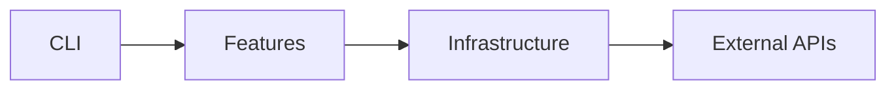
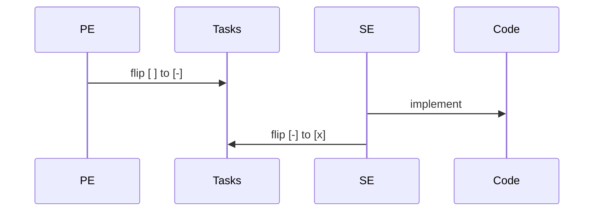

## Propósito

O dadaia-workspace é uma biblioteca Python que provê a infraestrutura de agentes, specs, e painel de controle.

Referência cruzada: ver [[tech-stack]] para detalhes do stack e [[panel]] para o painel.

## Fluxo de uso

Cada release passa por fases: SPEC → PLAN → TASKS → IMPLEMENTATION → CLOSURE.

| Fase | Responsável | Artefato |
|------|-------------|---------|
| SPEC | product-engineer | SPEC.md |
| PLAN | product-engineer | PLAN.md |
| TASKS | software-engineer | TASKS.md |

## Estado runtime tocado

- `specs/releases/ACTIVE.md` — release ativa
- `.dadaia/states/primary_context.json` — contexto primário

## Dependências

Dependências principais:

- `typer` — CLI framework
- `jinja2` — template engine
- `pyyaml` — YAML parsing

## Diagrama de dependências

## Diagrama de fluxo SDD

