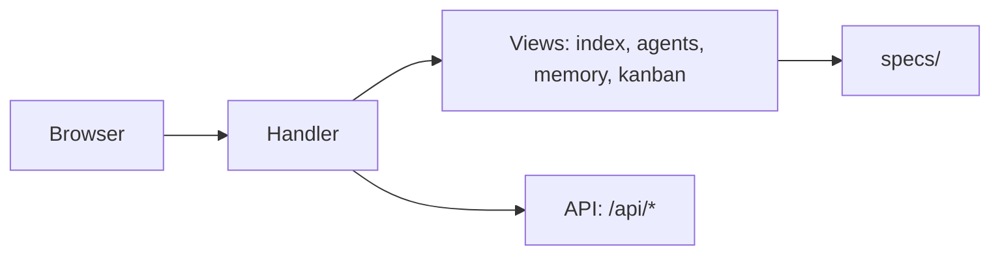

## Propósito

O Panel é um servidor HTTP Python puro (sem frameworks) que serve a interface web do workspace.

Veja [[architecture]] para as camadas e [[tech-stack]] para o stack.

## Fluxo de uso

1. Operador executa `dadaia panel start`
2. Panel escuta em `localhost:<port>`
3. Navegador acessa `/` para a interface principal

## Trigger típico

`dadaia panel start --port 8080`

## Diferencial

Servidor HTTP sem dependências externas de framework — apenas `http.server` da stdlib.

## Estado runtime tocado

- Processo do servidor HTTP (PID registrado via `dadaia server register`)
- `specs/releases/ACTIVE.md` — exibida no painel

## Dependências

- `dadaia_workspace/features/panel/handler.py`
- `dadaia_workspace/features/panel/views/`
- `mistune` para renderização de atoms de memória

## Diagrama de rotas

